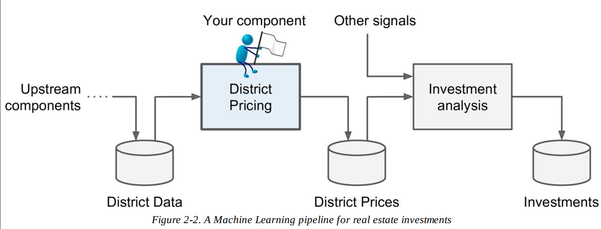

'''''
{
"title": "1_California-Housing-Notebook",
"keywords": "Regression, Big-Picture ",
"categories": "",
"description": "Hier geht es um die individuelle Abarbeitung der Checkliste Big-Picture im Kontext der California-Housing Problematik",
"level": "10",
"pageID": "14112020-10-California-Housing"
}
'''''

<h1>California Housing   Big-Picture</h1>

In diesem Notebook werden die ersten Problemstellungen von der California Hosuing Challenge aus dem Buch Handson Machine Learning bearbeitet. Dazu wird folgende erste  [Checkliste für das Big-Picture-Framing](14112020-SectionIndex-BigPicture)  in diesem Notebook abgearbeitet.

1. [Business Objectives](07112020200718-BusinessObjectives) 
in dem gegebenen Szenario wird das Modell  in folgendem Setup verwendet:

- Das Modell wird fließt als weitere Teilkomponente in die Investment Analyse ein.
  - Folglich muss im Szenario kein Frontend gebaut werden
- Das Modell soll den Mitlleren Hauswert der Gegen berechnen
  

2. [Nutzung des Produktes](07112020200718-Nutzung) 
   - Das Produkt wird vollautomatisch verwendet
   - Ergo sollen APIs für die vor und nachgealgerten Produkte bereitstehen

3. [Gegenwärtige Lösungen](07112020200718-CurrentSolutions) 
   - Menschliches Experten-Team ~ Error rate 15%

4. [Problem Framing](7112020200718-Detailed-DS-Framing) 
   - Regressions-Fragestellung
   - [Supervised Mode](07112020200718-SupervisedUnsupervised),  die Daten liegen gelabelt vor

5. [Perfomrance Measure](07112020200718-PerformanceMeasure) 
   - Da eine Regression vorliegt, werden die [Performance Measures](07112020200718-Performance-Measure) von der Regression verwendet.

6. [Perfomrance Measure-Business Objectives](07112020200718-PerformanceMeasureBusinessObjectives) 
   Bisheriges menschliches System hat eine Fehlerrate von 15%

7. [Minimum Performance](07112020200718-MinmumPerformance) 
   
8. [Vergleichbare Problemstellungen](07112020200718-ComparableProblems) 

9. [Akutelle Lösungen](07112020200718-CurrentSolutions) 
10. [Akutelle Lösungen](07112020200718-CurrentSolutions) 
11. [Annahmen  niederschreiben](07112020200718-ListAssumptions) 
    - BSPW wir bleiben unseren Worten treu, dass wir einen konitnuilerichen Wert (Regression) vorhersagen. Eine Alternative wäre, dass wir eine Kategorie übergeben könnten.(teuer/Medium/Günstig)
12. [Annahmen verifizieren](07112020200718-VerifyAssumptions) 
13. [Verwendung der Technologie](07112020200718-VerifyAssumptions) 
    - Für die Abarbeitung dieses Beispiel-Projektes verwende ich Jupyter-Lab Notebooks und Markdown-Files.
    - Ich verwende die klassische [Base-Envrionment]() meines Entwicklungsrechners

07112020200718-ListAssumptions
   
  

   
07112020200718-Detailed-DS-Framing

