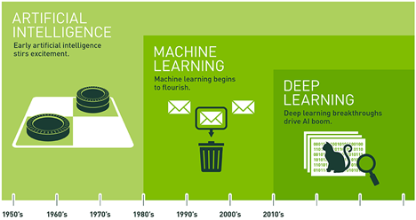
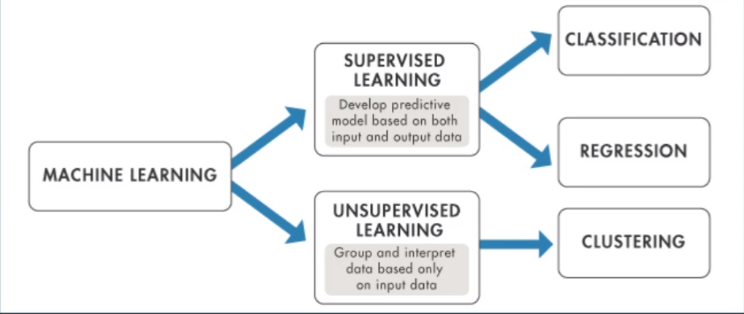
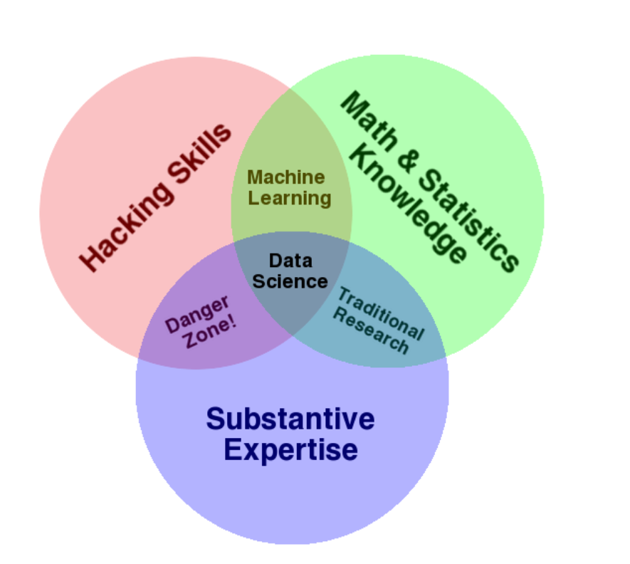
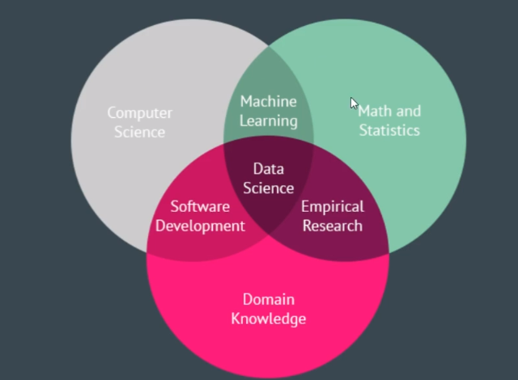

'''''
{
"title": "Begriffsabgrenzungen Data-Science",
"keywords": "AIDef",
"categories": "AiAIDef",
"description": "AIDef",
"level": "10",
"pageID": "07112020200718-AIDef"
}
'''''

<h1>Terminologie Abgrenzung</h1>

# DS-AI-KI-ML-DL Termniologie Abgrenzung
'''tableConverterStart
| Zeichnug 1         | Zeichnung 2          |
| ------------- |:-------------:|
|      | |
'''tableConverterEnd

Die obenstehende Grafiken veranschaulichen die Entwicklung der Begriffe anhand der zeitlichen Historie. Außerdem ist die logische innere Schachtelung ersichtlich. 

## Artificial Intelligence (AI / KI)

AI / KI zielt darauf ab menschliches Verhalten durch Verwendung der Gesetze aus der Logiklehre, den Entscheidungsbäumen und den Konditionalverzweigungen zu imitieren. Berühmte Beispiele sind IBM’s Deep Blue (Schachautomatisierung| Schlug im Jahr 1996 den damaligen Weltmeister Garry Kasparov) oder Googles AlphaGo, welches ausschließlich für die Automatisierung des Spiels Go dient, und ebenfalls erfolgreiche Go-Titel-Inhaber schlug. Der Unterschied der beiden Technologien lag darin, dass IBM’s Deep Blue jeden weiteren möglichen Spielzug im Laufe eines Schachspiels „brute-forcte“. Dieser „einfache“ Ansatz war jedoch durch die höhere Komplexität des Spieles Go nicht in dieses übertragbar. Die „Intelligenz“ von Alpha Go liegt in der Art wie das Spiel gelernt wurde. Hierbei wurde ein Reinforcemnet-Algorithmus implementiert, in welchem Alpha-Go im "maschinellen SInne" lernte effizient Go  zu spielen. 

Einfache Automatismen, welche Menschliches verhalten ausführen fallen unter den Begriff KI / AI

## Machine-Learning (ML)
ML bietet für ein System die Möglichkeit aus bestehenden Daten zu lernen, ohne explizit auf den möglichen Output hin programmiert zu sein. Dabei werden die Vorgehensweise der Algorithmik praktisch implementiert. 
Im Gegensatz zum Deep-Learning kann im Machine-Learning ein Mensch in die Datenanalyse (noch) eingreifen. 
Mögliche Maschine-Learning Aufteilung:

*Machine Learning is the science (and art) of programming computers so they can learn from data.*

BSP für Machine Learning Implementierungen:
- Spamfilter

## Deep-Learning (DL)
DL ist die ein Teilbereich des ML. Hierbei werden Muster aus Datensätze mithilfe von Neuronalen Netzwerken extrahiert. (Konkret liegt ein DL-NN vor sobald, ein hidden Layer im System vorliegt => Sprich ein Single-Layer Preceptrton ist noch kein DL, aber sobald wir input, hidden und Output Layer haben liegt ein DL vor => Identifier für ein DL ist der Hidden-Layer).
Neuronale Netze wiederum basieren auf der Funktionsweise des biologischen Nervensystems. Somit kann der Prozess des Lernens automatisiert werden. Neuronale Netze adaptieren die eigenen Parameter (Gewichte) während des Lernvorgangs, dem sogenannten „Trainings“. Diese entstehenden Modelle werden anschließend in der Verwendung Neuronaler Netze für die Prognose verwendet.

Wichitg bei DL == NN ist es eine Erweiterung der Lineren Regression. 
 

Somit ist ein SingleLayer Network noch nicht "deep".

Anglehnt an die Funktionsweise des menschlichen Gehirns, kann soowhl für Regression als auch für Klassifikationsfragestellungen verwendet werden. 

## Venn-Diagramm DataScience
Für die Einordnung was Data-Science eigentlich behandelt:
'''tableConverterStart
| Zeichnug 1         | Zeichnung 2          |
| ------------- |:-------------:|
|     | |
'''tableConverterEnd

## AI im Kontext Datascience

[Erklärung Venn-Diagramm](http://drewconway.com/zia/2013/3/26/the-data-science-venn-diagram)

## AI-Limitation 
- Moore’s Law➢CPU power still grows at exponential rateData
- available data double every two yearsAlgorithms
- major improvements in the last decadeFunding
- highest funding rate for AI in historyOpen Source
- latest technology available open source

# Definition Intelligenz

**7 areas of ai (1955)**
1. Simulating higher funtions of the human brain
2. Programming a computer to use gerneral language
3. Arranging hypothetical nuerons in a manner so that they can afford concepts
4. A way to dermine and measuer Problem complexity
5. self improvmenet
6. Abstraction: Defined as the quality of dealing with ideas rather than events
7. Randomness and creativity
