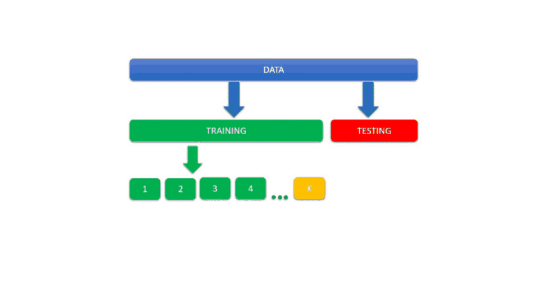

'''''
{
"title": "Data",
"keywords": "Data",
"categories": "Data",
"description": "Hier die Definition und die Aufteilung zu Data",
"level": "20",
"pageID": "07112020200718-Data"
}
'''''

<h1>Daten - Defintion entlang des DS-Prozesses</h1>

ML / DS / DL Modelle benötigen Daten. Dabei sind "Daten" nicht per se "Daten" in diesem Kontext. Diese Webpage gibt eine nkleinen aber feinen Überblick wie der Begriff Daten zu welchem Zeitpunkt in einem MDS-Project verstanden werden kann. Die technische Implementierung ist in diesem [Notebook](16112020-TrainTestSplit-Implementation) exemplarisch dargestellt.

---
---

## Gesamtes Dataset
Das sind alle Daten, auf welche wir zugreifen können. Normalerweise lädt man dieses Set von einer [REMOTE-Quelle](15112020-PythonSolutionsDataDownload) herunter und lädt innerhalb eines DS-Projectes diese gesamten Daten zunächst in ein Data-Frame(entweder numpy oder Pandas) 

## Train-Data

Auf diesem Trainings-Set werden die Algorithmen trainiert.

---
---

## Test-Daten
Das ist das Set mit welchem wir die Performance des "von uns" trainierten Modelles testen. Somit wird das Modell ausschließlich auf den Trainingsdaten trainiert. 
Verwirrend wird es, da häufig in der Literatur Validieren und Testen as gleiche Begriffe verwendet werden. Dieses Set wird zu beginn jeglicher Verarbeitungsschritte "beiseite" gelegt, sodass der fertig trainierte Algorithmus mit diesem Set getestet werden kann.

 

---
---

## Validation-Set
Bei der Validierung wird sichergestellt, dass das "inzwischen" trainierte Modell gut generalisiert. 

Bei der Validation gibt es 2 Möglichkeiten der Implementierung
1. Das Validation-Set wird von dem **Gesamten Data-Set** gezogen. Dadurch entsteht "immer wieder" ein neues Trainings-Set

---

2. Das Validation-Set wird ausschließlich von dem bereits gesplittetn **Training Data-Set** gezogen.

Um diese Validation-Sets zu erstellen gibt es unterschiedliche Strategien. Diese werden [hier](07112020200718-Validation) beschrieben

---
---

## Überlegungen
Bei [Online-Learning]() Systemen kommen durchgehend neue Daten "rein". Wie geht man mit alten Splits Um?
- werden immer die Daten "neu" aufgeteilt, d.h beim Trainieren des Modelles mit Datensatz 1 wird ein eigenständiger Split gemacht & beim Trainieren mit Datensatz 2 erneut ein eigenständiger split?
- Werden die Daten die in DS1 als Train gesetzt wurden auch in in DS2 ebenfalls als Train gesetzt? Wenn ja beachte [diese Implementierung](16112020-TrainTestSplit-Implementation)

