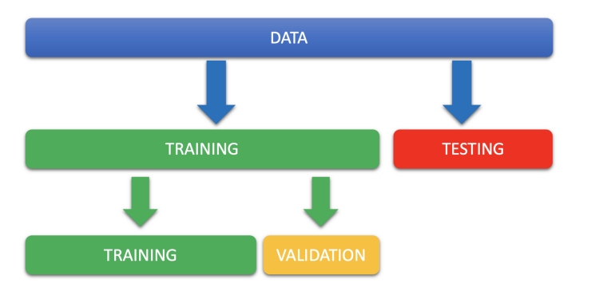
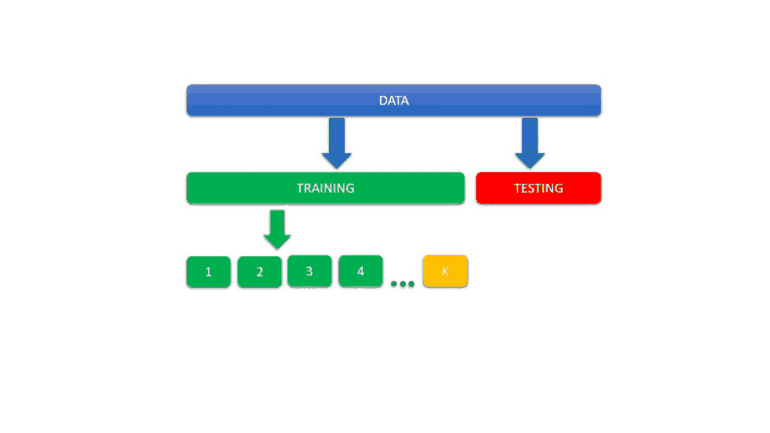
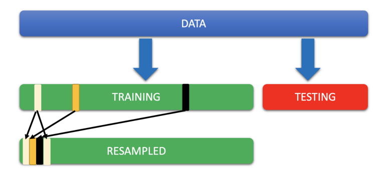

'''''
{
"title": "Validation",
"keywords": "GenerValidationalisierung",
"categories": "Validation",
"description": "Hier die Definition und die Aufteilung zu Validation",
"level": "40",
"pageID": "07112020200718-Validation"
}
'''''

<h1>Validation-Strategies</h1>

## Hold-Out-Validation

Bei dem Hold-Out set werden klassischerweise zunächst ein "normaler" Train-Test-Split getätigt. Auf das Dabei enstehende Training-Set wird dann ein weiterer Split erstellt, welcher wiederum das Validation set bildet.

- Vorteile
  - Test-Daten werden nicht berührt
  - nicht so sehr Rechenintensiv
  
- Nachteile (v.a. ggb k-Fold)
  - [generalisiert](./002_Generalisierung.md) nicht so gut
  

## K-Fold-Cross

K-Fold-Cross Validation ist der weiderholte Hold-Out-Prozess, wobei in jeder Wiederholung ein neues Validation-Set verwedet wird. Somit lernt der Algorithmus "sukzessive " auf unterschieldichen Validationsets. Dabei wird das Training set in n gleich große(=gleiche Anzahl an Instanzen) Subdatensätze aufgeteilt.

- Vorteile
   - [generalisiert](./002_Generalisierung.md) besser als die einfache Hold-Out-Validation
- Nachteile (v.a. ggb k-Fold)
  - Rechenintensiv

## Leave One Out Cross Validation
Spezielle Form von K-Fold-Crossvalidation. Hierbei ist die Größe des Validation-Sets = 1. 

- Vorteile
   - [generalisiert](./002_Generalisierung.md) *noch* besser als die K-Fold-Cross-Validation
- Nachteile (v.a. ggb k-Fold)
  - *noch* Rechenintensiver als die K-Fold-Cross-Validation

## Bootstrap Resampling
Beim Bootstrapping werden zuletzt die Bags individeull befüllt. Dabei kann ein Datenpunkt aus dem Training set mehrfach im Bag vorkommen. 

  

## Links
- [Medium](https://medium.com/x8-the-ai-community/use-of-cross-validation-in-machine-learning-f3b80ad813e6)
