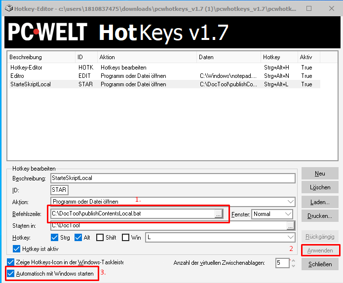

'''''
{
"title": "PC-Welt HotKeys",
"keywords": "Batch, Automation, Tastenkombination, ",
"categories": "Automation",
"description": "Beschreibung eines Tools mit welchem sich in Windows globale und lokale Tastenkombinationen verwalten lassen",
"level": "00",
"pageID": "09112020-0745-PcWeltHotKeys"
}
'''''

<h1>PC-Welt HotKeys</h1>

# Problemstellung
Ich arbeite mit Batchskripten in Windows 10 und öffne diese grundsätzlich per Mausklick. Ich möchte eine globale Tastenkombination anlegen um dieses Batchskript "allzeit" und aus jeder Menütiefe automatisch aufrufen zu können.

# Lösung
Mit dem Tool [PC-Welt HotKeys](https://www.pcwelt.de/downloads/PC-WELT-HotKeys-10036116.html) lassen sich Hotkeys ersteleln und aufrufen

# Good to know

1. Pfad zu der Batch-Datei
2. nach dem Anlegen muss diese auch angewendet werden
3. Automatischer Start, sodass nach dem Boot von Windows die Tasentkombinationen auch vorliegen