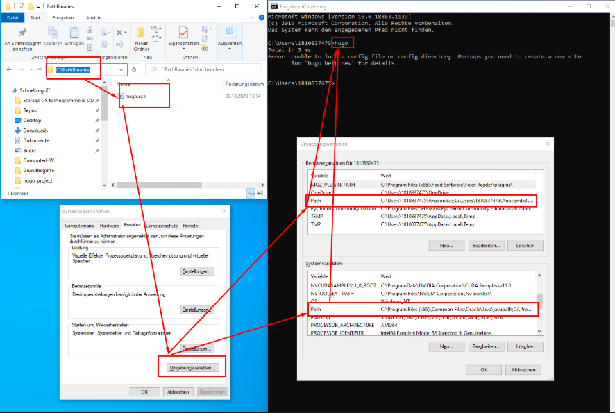

<h1>Pfad-Variable Windows</h1>

Die Pfad Variable ist ein Verweis auf [Binary-Datei](./../../Grundbegriffe/BinaryFile.md). Ist eine Binary-Datei in der Pfad Variable hinterlegt, so kann diese aus jedem beliebigen Verzeichnis, auf welches die Konsole gegenwärtig zeigt, auf die jeweilig hinterlegt Binar zugegriffen werden.

Dass ein Windows eine Binary im Pfad hinterlegt ist, muss diese entsprechend den Umgebungsvariablen hinzugefügt werden. Um eine Datei zu hinterlegen geht man wiefolgt vor:

1) Wähle ein Verzeichnis in welchem die Binary/ies abgelget werden
2) Öffne die Umgebungsvariablen
3) Hinterlege sowohl den Pfad als auch die Datei selbst in sowohl den lokalen als acuh Nutzer Umgebungsvariablen    
4) Melde den Nutzer ab und wieder an
5) Prüfe in der Konsole ob die Binary nun in den Umgebungsvariablen hinterlegt ist. BSP hier 
> hugo version

