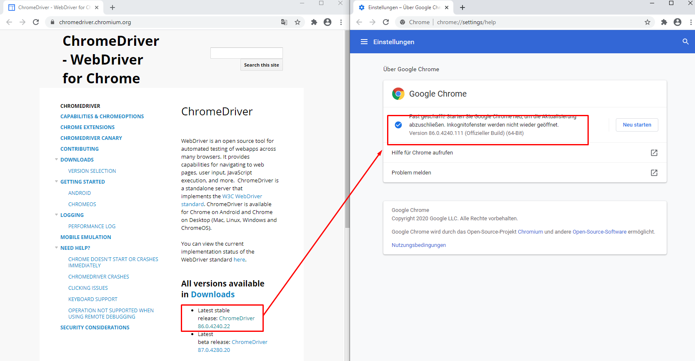
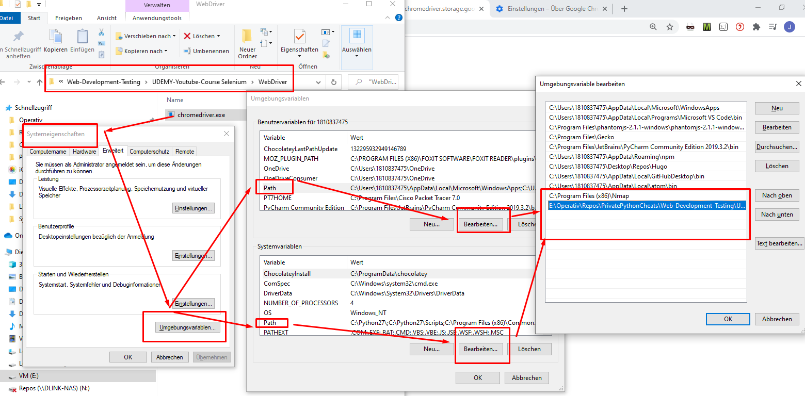
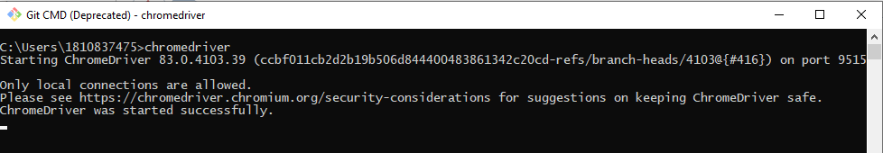

<h1 id="Video-1">Video 1<a class="anchor-link" href="#Video-1">&#182;</a></h1><ul>
<li>Erklärung warum Selenium gut ist</li>
<li>Erklärung Basic-Installation <ul>
<li>Installation Bibliothek Selenium</li>
<li>Einbinden der Executable (Chromedriver, geko, etc) in dem OS</li>
</ul>
</li>
</ul>

In&nbsp;[5]:

    

<pre>from IPython.display import YouTubeVideo

YouTubeVideo(&#39;u1T2v2Ucuuc&#39;, width=800, height=300)
</pre>

    

    
Out[5]:

        <iframe
            width="800"
            height="300"
            src="https://www.youtube.com/embed/u1T2v2Ucuuc"
            frameborder="0"
            allowfullscreen
        ></iframe>
        

Selenium = Programm, welches auch in Python genutzt werden kann

Automatisches User-Verhalten

<ul>
<li>testen</li>
<li>Stupide Aufgaben Automatisieren</li>
<li>In Kombination mit Python </li>
</ul>
<h2 id="Technologien">Technologien<a class="anchor-link" href="#Technologien">&#182;</a></h2><ul>
<li>Python</li>
<li>pip</li>
<li>
WebDriver für Browser

<ul>
<li>
<a href="https://chromedriver.chromium.org/">Chrome</a> // Auswahl Linux / Windows

</li>
<li>
<a href="https://github.com/mozilla/geckodriver/releases">Firefox</a> // windows und Linux

</li>
<li><a href="https://developer.microsoft.com/en-us/microsoft-edge/tools/webdriver/">Web-Driver-Edge</a> // nur Windows</li>
</ul>
</li>
</ul>

der Webdriver muss heruntergeladen werden und im jeweiligen OS in die Pfad-Variablen hinzugefügt werden. <a href="https://github.com/JHC90/Windows/blob/master/Umgebungsvaribalen.md">Pfadvaribalen Windows</a>  oder <a href="https://github.com/JHC90/Linux/blob/master/Path-Variable.md">Pfadvariablen Linux</a>

Hier ein BSP für das einbinden einer Umgebungsvariable in Windows

hier der <a href="./../../../../Operating-Informatik/Windows/Path-Variable.md">Link</a> zu der Erklärung wie man in Windows Dateien zum Pfad hinzufügt.

FUnktionsfähigt ist der Spass wenn chromedriver somit von der CLI aus aufgerufen werden kann:

Installation von Slenium

In&nbsp;[6]:

    

<pre>#!pip install selenium
</pre>

    

 

