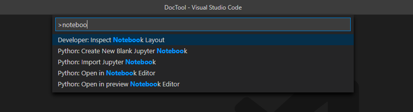
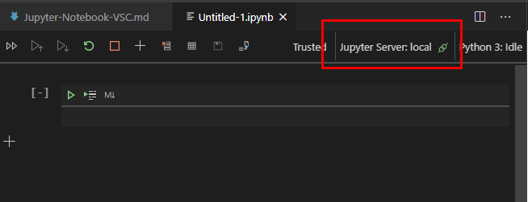
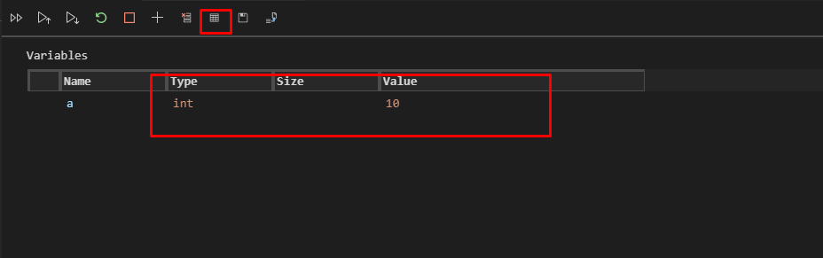

<h1>jupyter notebook in VS-Code</h1>

https://www.youtube.com/watch?v=IBdhwrfgP9c

1. Check ob Notebook am gegenwäritgen VCS installiert ist

2. Check ob Jupyter-Server aktiv ist

3. wenn das ganze nicht exisitiert muss man Jupyter installieren
>pip install jupyter
4. Praktisch ist auch der Variable-Explorer

5. 