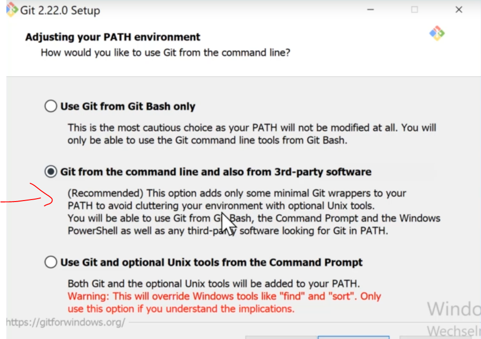

# Git Version

Mit folgendem Befehl kann ich OS-Unabhängig prüfen ob git bereits lokal installiert ist

>verification git --version

Git funktioniert auf der Commandline OS-unabhängig. Die einzigen Unterschiede bestehen in der lokalen Installation, welche wiederum hier erklärt ist. 

# Git Installation Linux

Logischerweise kein Git-Server, sondern ein Git-Client.

> sudo apt-get update
> sudo apt-get upgrade
> sudo apt-get dist-upgrade
> sudo apt-get install git || sudo apt install git

Mit folgendem Befehl kann ich OS-Unabhängig prüfen ob git bereits installiert ist

# Git Installation Microsoft

Logischerweise kein Git-Server, sondern ein Git-Client.

Unter diesem [Link](https://git-scm.com/download/win)

die entsprechende Version(32||64 Bit) für das jeweilige Windows herunterladen und ausführen
Normalerweise genügt die GIT-Bash. Ich installiere aber gern die Git, das kann man später in der Integration zu PyCharm, VsCode, usw brauchen.

mit dem Befehl
>verification git --version

kann ich verifizieren, dass git installiert ist

