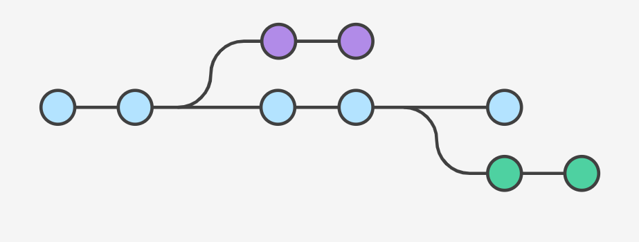

<h1>Git-Branches-Überblick</h1>

Mit Branches kann das Git-Porjekt an mehrerenEnden gleichzeitig entwicklet werden

Das ist gut für:

* Kollaboration
Bsp können mehrere Team-Kollegen unterschiedliche IMplementierungen tätigen. Dabei kann unabhängig voneinander entwickelt werden
  * BSP Ein team Fehlerbehebung am Master-Branch => Hotfixes
  * Ein Team implementiert neue Funktionalität => Developmentbranch
* Alleinarbeit
  * Es können unterschiedliche Funktionalitäten gleichzeitig entwickelt werden
  * Es kann der Masterbranch live geschaltet sein, während in den Featurebranches Funktionalität entwickelt und getestet wird 

Das Konzept lautet dass man von einem Zweig(meist vom Master) einen Branch abzweigt. Die Änderungen tätigt, diese Änderungen im abgezweigten Branch testet und den geänderten Branch in den Master zurückführt.

----
<small>Hotfix = schnelle Änderungen eines Bugs am Master</small>
