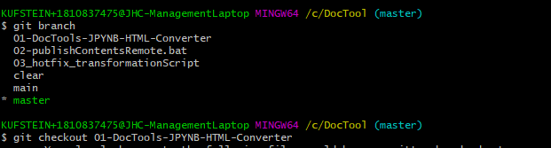

'''''
{
"title": "git checkout",
"keywords": "git, branch, checkout",
"categories": "",
"description": "Hier wird das Wechseln zwischen loaklen Branches erklärt",
"level": "10"
}
'''''

<h1>git Branch - Wechseln</h1>

mit dem Befehl

>git checkout "branchname"

kann ich lokal zwischen den Branches wechseln. Dieser Wechsel von einem Branch in den anderen erfolgt nur wenn der gegenwärige Branch commitet oder gestasht ist.

