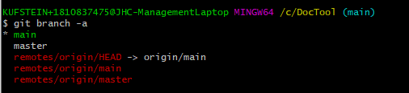

'''''
{
"title": "git branch -a",
"keywords": "git, branch, branch -a",
"categories": "",
"description": "Hier wird das Anzeigen von Git Branches lokal und remote innerhalb des CLI erklärt",
"level": "10"
}
'''''

<h1>git Branch - Anzeigen</h1>

mit dem Befehl

>git branch

kann ich mir anzeigen lassen welche Branches lokal existieren und in welchem ich gerade arbeite.

mit dem Befehl 

>git branch -a 

werden auch die remote Branches angezeigt.

