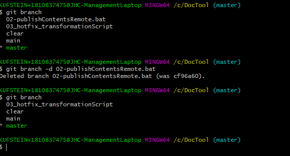

'''''
{
"title": "Löschen lokaler Branches",
"keywords": "git, branch, deleteBranch",
"categories": "",
"description": "Hier wird das Löschen von Git Branches lokal innerhalb der CLI erklärt",
"level": "10"
}
'''''

<h1>git branch delete - Löschen eines lokalen Branches</h1>

## Löschen lokaler Branch
Vor allem wenn viele Teammitglieder an einem Projekt arbeiten entstehen viele Branches. Dabei kann es schnell unübersichtlich werden.
Nicht mehr benötigte Branches können lokal wiefolgt gelöscht werden:

> git branch -d "Branchname"

## Löschen Remote Branch
> git push origin --delete feature-101

----

