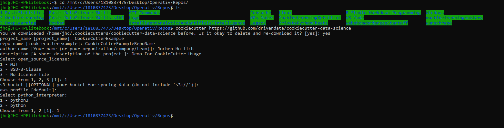

# 1. Linux-Basics

Für die Verwendung von Git hilft es grundlegende Befehle in Linux zu Begreifen. Checkout mein [LinuxRepo](https://github.com/JHC90/Linux).
Außerdem habe ich mein eigenes [Repo](https://github.com/JHC90/Linux/tree/master/Gitlab-Server) wie man einen Git-Server OnPrem auf einem eigenen Ubuntu-Server ausrollt.

<b>TOC</b>

<!-- TOC -->

- [1. Linux-Basics](#1-linux-basics)
- [2. Basics](#2-basics)
  - [2.1. Git User lokal An & Abmelden](#21-git-user-lokal-an--abmelden)
  - [2.2. Git - Quick and Dirty](#22-git---quick-and-dirty)
  - [2.3. Fork fremdes Git Repo](#23-fork-fremdes-git-repo)
  - [2.4. Change in git-tracked File](#24-change-in-git-tracked-file)
  - [2.5. Rename git-tracked File](#25-rename-git-tracked-file)
  - [2.6. Remove git-tracked File](#26-remove-git-tracked-file)
- [3. Wiederherstlellen](#3-wiederherstlellen)
  - [3.1. lokale Histroy](#31-lokale-histroy)
  - [3.2. Wiederherstellen des Staging](#32-wiederherstellen-des-staging)
  - [3.3. Wiederherstellen des lokalen Repos](#33-wiederherstellen-des-lokalen-repos)
- [4. Branching](#4-branching)
  - [4.1. Branching Überblick & git fetch](#41-branching-überblick--git-fetch)
  - [4.2. Create (Feature)Branch](#42-create-featurebranch)
  - [4.3. Create Remote Branch && Connect Local Branch mit Remote Branch](#43-create-remote-branch--connect-local-branch-mit-remote-branch)
  - [4.4. Update Feature-Branch mit Most-Recent Master](#44-update-feature-branch-mit-most-recent-master)
  - [4.5. Wechsel von Branches / Hotfix](#45-wechsel-von-branches--hotfix)
    - [4.5.1. Bsp Hotfix // erstellen neuer Branch](#451-bsp-hotfix--erstellen-neuer-branch)
  - [4.6. Branches zusammenführen // merge](#46-branches-zusammenführen--merge)
  - [4.7. Versionskonflikte / Merge Conflict](#47-versionskonflikte--merge-conflict)
  - [4.8. git Rebase](#48-git-rebase)
  - [4.9. git stash](#49-git-stash)
- [5. Git Konfigurationen](#5-git-konfigurationen)
  - [5.1. Initilaisiere eigenes Projekt](#51-initilaisiere-eigenes-projekt)
    - [5.1.1. bisherige Solution](#511-bisherige-solution)
    - [5.1.2. Solution aus dem Videotutorial](#512-solution-aus-dem-videotutorial)
- [6. Git ignore](#6-git-ignore)
- [7. Git Tipps](#7-git-tipps)
  - [7.1. Tags & Releases](#71-tags--releases)
  - [7.2. git blame](#72-git-blame)
  - [7.3. Git-Hub Desktop](#73-git-hub-desktop)
- [8. Git LFS](#8-git-lfs)
- [9. Erweiterungen zu Git](#9-erweiterungen-zu-git)
  - [9.1. Cookiecutter](#91-cookiecutter)

<!-- /TOC -->

# 2. Basics
## 2.1. Git User lokal An & Abmelden
* [Git-User an und Abmelden](./Legacy/HinterlegenDesGitAccountsLokal.md)

## 2.2. Git - Quick and Dirty
[Git - Quick and Dirty](https://www.udemy.com/course/git-grundlagen/learn/lecture/15704964#overview)
Hier wird ein  als erstes ein Github User erstellt, ein erstes eigenes Projekt im Webinterface erstellt und anschließend auf den lokalen rechner geklont, eine Datei hinzugefügt, geadded, comittet und wieder zurück gepusht.

* Check ob git Installiert ist
  
  > git version
* [Hinterlegen von lokalen User-Credentials - Wenn kein SSH gewünscht sit](./Legacy/HinterlegenDesGitAccountsLokal.md)
* [Hinterlegen von lokalen und remote User-Credentials - mit SSH // Multiaccount-Strategie auf einer lokalen Maschine](./Legacy/0_p_MultiUseraccount.md)
* [Hinterlegen von Remote User-Credentials / Verbindung zum Server](./Legacy/GitRemoteCredentials.md)
* Erstellen neue verzeichnis im OS & wechsel in das verzeichnis (linux mkdir / cd / usw)
* [git clone](./Legacy/GitClone.md)
* [git status](./Legacy/GitStatus.md)
* Erstellen neue Datie im OS & wechsel in das verzeichnis (linux touch/nano/vi usw.)
* [git add](./Legacy/GitAdd.md)
* [git commit](./Legacy/GitCommit.md)
* [git push](./Legacy/GitPush.md)

## 2.3. Fork fremdes Git Repo
[Fork fremdes Git Repo](https://www.udemy.com/course/git-grundlagen/learn/lecture/15704986#overview)
hier wird zunächst ein bestehendes Repo von einem anderen Git-User geforkt. dieses dann in das local repo geklont und ist somit im Arbeitsbereich für die Berarbeitung bereit
* [git fork](./legacy/GitFork.md)
* [git clone](./Legacy/GitClone.md)
* [git status](./Legacy/GitStatus.md)
* Datei bearbeiten

## 2.4. Change in git-tracked File
[Change in git-tracked File](https://www.udemy.com/course/git-grundlagen/learn/lecture/15705008?start=0#overview)
grundsätzlich wird hier eine Datei geändert und diese Änderung dann in das Repo übernommen. Voraussetzung = hier muss ein Repo bereits existieren

* Änderungen der Readme Dateien
* [git status](./Legacy/GitStatus.md) => Datei wurde geändert 
* [git commit](./Legacy/GitCommit.md)
* [git push](./Legacy/GitPush.md)

## 2.5. Rename git-tracked File
[Rename git-tracked File](https://www.udemy.com/course/git-grundlagen/learn/lecture/15844198#overview)
* [git move](./Legacy/GitMove.md)

## 2.6. Remove git-tracked File
[Remove git-tracked File](https://www.udemy.com/course/git-grundlagen/learn/lecture/15846852#overview)
* git ls-files => zeigt alle enthaltenen files // ähnlich wie ls
* [git rm](./Legacy/GitRemove.md)
* [git commit](./Legacy/GitCommit.md)
* [git push](./Legacy/GitPush.md)

# 3. Wiederherstlellen

## 3.1. lokale Histroy
 [lokale Histroy](https://www.udemy.com/course/git-grundlagen/learn/lecture/15846882#overview)
hier zeigen wir die lokale history und die Details zu den einzelnen Einträgen in der lokalen History
* [git log](./Legacy/GitLog.md)
* [git show](./Legacy/GitShow.md)

## 3.2. Wiederherstellen des Staging
 [Wiederherstellen aus dem lokalen Repo](https://www.udemy.com/course/git-grundlagen/learn/lecture/15846888#overview)

 hier wurde zuvor die fehlerhafte Datei noch NICHT commitet. wenn BEREITS commitet => [Wiederherstellen des lokalen Repos](#wiederherstellendeslokalenrepos)

Wenn wir ein laufenden Commit haben & im working directory fehler einbauen. Jetz wollen wieder zu der commiten / gestagten / laufenden Version zurück gehen. //

* [git checkout](./Legacy/GitCheckout.md)
* [git reset](./Legacy/GitReset.md)
* [git show](./Legacy/GitShow.md)

## 3.3. Wiederherstellen des lokalen Repos
 [link](https://www.udemy.com/course/git-grundlagen/learn/lecture/15846892#overview)

 hier wurde zuvor die fehlerhafte Datei noch BEREITS commitet. wenn nicht commitet =>[Wiederherstellen des Staging](#wiederherstellendesstaging)

 * [git revert And git reset](./Legacy/GitLogRemote.md)

# 4. Branching

## 4.1. Branching Überblick & git fetch
 [Link](https://www.udemy.com/course/git-grundlagen/learn/lecture/15846936#overview)
Fremde Änderungen von 

  * [git Branching overview](./Legacy/GitBranchesOverview.md)
  * [git fetch](./Legacy/GitFetch.md)
  * [git pull](./Legacy/GitPull.md)

## 4.2. Create (Feature)Branch
 [Link](https://www.udemy.com/course/git-grundlagen/learn/lecture/15846942#overview)

Hier wird erklärt wie man eine Branch erstellt

  * [git checkout -b](./Legacy/GitBranchCreate.md)
  * Änderungen im neuen Branch
  * [git log](./Legacy/GitLog.md)

## 4.3. Create Remote Branch && Connect Local Branch mit Remote Branch
Hierzu gibt es kein Video im Udemy => hier die [Quelle](https://www.freecodecamp.org/forum/t/push-a-new-local-branch-to-a-remote-git-repository-and-track-it-too/13222) dazu

* [Connect Local mit Remote Branch](./legacy/GitConnectLocalRemoteBranch.md)

## 4.4. Update Feature-Branch mit Most-Recent Master
[git update Branch](./Legacy/GitBranchesUpdateMaster.md) => Create Branch hotfix & wechsel direkt hinein)

## 4.5. Wechsel von Branches / Hotfix
 [Link](https://www.udemy.com/course/git-grundlagen/learn/lecture/15846948#overview)

### 4.5.1. Bsp Hotfix // erstellen neuer Branch
 * [git checkout -b](./Legacy/GitBranchCreate.md) => Create Branch hotfix & wechsel direkt hinein
*  [git branch](./Legacy/GitBranch.md) => Anzeige der möglichen Branches, hier ist jetzt hotfix dabei
*  Erstellen der Änderung in dem Hotfix Branch
*  [git status](./Legacy/GitStatus.md) => zeigt die Änderung die nun in dem branch hotfix gemacht wurden 
* [git add](./Legacy/GitAdd.md) && * [git commit](./Legacy/GitCommit.md) im lokalen Repo
* [git diff](./Legacy/GitDiff.md) Vergleichen von unterschiedlichen Brances, zeigt die speziellen Änderungen an

## 4.6. Branches zusammenführen // merge
 [Link](https://www.udemy.com/course/git-grundlagen/learn/lecture/15846958#overview)

* Teseten in dem abgezweigten Branch, dass die Änderungen wie gewünscht laufen
 * [git checkout](./Legacy/GitCheckout.md) Wechsel von abgezweigen Branch in den Branch in den gemerget werden soll(bspw von branch Hotfix in den Branch master)
 *  [git merge](./Legacy/GitBranchesMerge.md) =>Commit der im hotfix gemacht wurde ist nun für den master erreichbar. Jetzt zeigt der Master einfach auf diesen Commit und der Spass ist gemerget
 *  [git branch -d](GitBranchDelete) löschen von nicht mehr benötigten Branches

## 4.7. Versionskonflikte / Merge Conflict
 *  [MergeConflict](./Legacy/GitBranchesMergeConflict.md) löschen von nicht mehr benötigten Branches

## 4.8. git Rebase

[Link](https://www.udemy.com/course/git-grundlagen/learn/lecture/15846974#overview)

Wenn ich allein arbeite kann ich rebase verwenden, sobald es um ein Remote Repo geht, an dem mehrere Personen arbeiten auf jeden Fall merge nutzen. 

Alternative zu [git merge](./legacy/GitMerge.md)

 *  [git rebase](./Legacy/gitRebase.md) löschen von nicht mehr benötigten Branches

## 4.9. git stash
[Link](https://www.udemy.com/course/git-grundlagen/learn/lecture/15847100#overview)

git Stash = Optionen Ändeurngen zu Speichern bevor man den Branch wechselt(ansonsten ist es nicht möglich den nicht commiteten Branch zu wechseln)

* [git stash]

# 5. Git Konfigurationen

## 5.1. Initilaisiere eigenes Projekt
[Link](https://www.udemy.com/course/git-grundlagen/learn/lecture/15846958#overview)
Hier beginne ich ein Projekt von 0 weg. Sprich ich erstelle lokal einen Ordner und los gehts. 

### 5.1.1. bisherige Solution
Hier erstelle ich zunächst ein Remote Repo im Webinterface, das Klone ich herunter & arbeite damit. Ergo kann ich sobald ich das lokal hab von lokalener Arbeitsbereit über staging, lokal Repo & remote Repo über den  bekannten Verdächtigen (git add / commit / push / pull / Fetch / checkout usw) hin und her navigieren

### 5.1.2. Solution aus dem Videotutorial
[Link](https://www.udemy.com/course/git-grundlagen/learn/lecture/15847064#overview)
* [git init](./Legacy/GitInit.md) <= hier geht es lediglich bis zum lokalen Repo, nicht bis zum remote Repo
<b>Eigene Ergänzung um eine Conneciton zwischen local und remote Repo zu erstellen.</b>
* [Connect Local mit Remote REPO](./legacy/GitConnectLocalRepoWithRemoteRepo.md)
* [Connect Local mit Remote BRANCH](./legacy/GitConnectLocalRemoteBranch.md)

# 6. Git ignore
[Link](https://www.udemy.com/course/git-grundlagen/learn/lecture/15847072#overview)

In der Git ignore kann ich definieren welche datein nicht in das Repo(lokal & remote) ignoriert werden sollen.

* [gitIgnore](./Legacy/GitIgnore.md)

# 7. Git Tipps

## 7.1. Tags & Releases
[Link](https://www.udemy.com/course/git-grundlagen/learn/lecture/15888946#overview)

Wenn man Stabile Versionen hat und weiterentwickelt. Nun kann es sein dass man nur mit den stabilen Versionen arbeiten mag

* [git tag](./legacy/GitTag.md) <= erstellen eines Tags(iwie ähnlich zu einem Commit, nur in "stable Version Commit"-Version)
* [git revert & git reset](./Legacy/GitLogRemote.md), da es wie ein Commit ist kann man im Falle hiermit einfach zurückspringen. 

## 7.2. git blame
[Link](https://www.udemy.com/course/git-grundlagen/learn/lecture/15888932#overview)

Wenn Änderungen bestehen und man nicht weis wer das war => herausfinden wer hat welche Änderung getätigt.

* [git blame](./legacy/GitBlame.md)

## 7.3. Git-Hub Desktop
[Link](https://www.udemy.com/course/webseite-mit-hugo-und-github-pages/learn/lecture/9329740#overview)
Ist gut wenn man nicht nur auf der Kommandozeile arbeiten mag, sondern auch eine GUI haben mag. 

[link zu github Desktop](https://desktop.github.com/)
Neuer Kurs, hier ist eien GUI-Version für die Verwaltung von Git hinterlegt.

# 8. Git LFS
Es kann vorkommen, dass datein einfach zu groß fürs eigentliche Git-Repo sind => lösung mit Git LargeFileSystem LFS

* [GitLFS](./Legacy/GitLFS.md)

---
---
---
# 9. Erweiterungen zu Git 
## 9.1. Cookiecutter
[LinkZumTutorial](https://cookiecutter.readthedocs.io/en/1.7.0/first_steps.html)
[LinkZumTutorial_DS-Specific](https://drivendata.github.io/cookiecutter-data-science/)

Führe dieses Tutorial mit Linux aus (im Windows mit linux subsystem , halt ubuntu terminal)

Im Großen und ganzen einfach eine Policy, wie was wo in dem entstehenden Ordner abgelegt wird und warum das so ist. 
Cookiecutter bringt einen Downloader mitsich, mit welchem wir Cuts herunterladen und nach unsere Vorstellungen modifizeiren können....das passiert im Schritt 3

hier deploye ich zunächst lokal das Template und schließe im anschluss die Connection zu dem Remote Repo

1. Install Cookiecutter
   > pip install cookiecutter
   oder 
   > sudo apt install cookiecutter <= prefered Way of deployment
   
2. navigate  in den Folder wo cookiecutter hineindeployed werden soll
3. Führe folgenden Befehl aus:
>cookiecutter https://github.com/drivendata/cookiecutter-data-science
4. Folge den Fragen fürs Deplyoment

5. navigiere in den Folder Hinein
6. Jetzt ist noch kein remote Repo mit dem bisher erstellten verbunden => kein .git folder hitnerlegt
7. Die Folder structure im [Tutorial](https://drivendata.github.io/cookiecutter-data-science/) anschauen & die Bedeutung der Ordner hinterlegen.