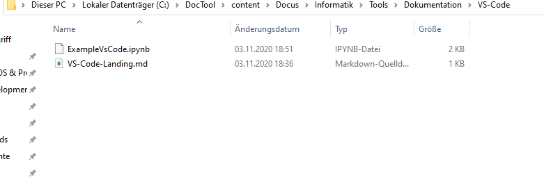

In&nbsp;[8]:

    

<pre>print(&quot;This is a littlecoder\n&quot; * 10)
</pre>

    

    

<pre>This is a littlecoder
This is a littlecoder
This is a littlecoder
This is a littlecoder
This is a littlecoder
This is a littlecoder
This is a littlecoder
This is a littlecoder
This is a littlecoder
This is a littlecoder

</pre>

In&nbsp;[6]:

    

<pre>a = 10
</pre>

    

In&nbsp;[19]:

    

<pre>import os
cmd = &#39;cd ,&#39;
print(os.system(cmd)
</pre>

    

    

<pre>
  File &#34;&lt;ipython-input-19-ca882b01ab66&gt;&#34;, line 3
    print(os.system(cmd)
                        ^
SyntaxError: unexpected EOF while parsing
</pre>

<h1></h1>

hallo das hier ist nur text

 

