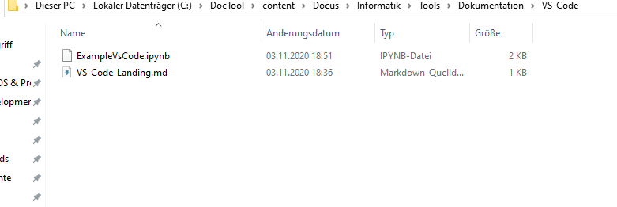

<h1>Visual-Studio Code - VSC</h1>

# Master-Waffe
Visual-Studio Code ist eine Allzweckwaffe. Hiermit kann bspw
- Python Code
- Jupyter Notebooks
- Yaml-Files
- Toml-Files
- Markdown
- HTML5-Suite
- R

Inhalte erstellt und gewartet werden. Konkret hat man als ITler somit eine Allzweckwaffe, welche auf jeden Beliebigen Einsatz verwendet werden kann. 

Mächtig ist VS-Code v.a. bei der Python entwicklung. Es kann das Prototyping in Jupyter erstellt werden, und der Productive code wird mit dem gleichen Tool erstellt.

# Weiter Links
[Basic Umgang mit Jupyter in VSCODE](https://towardsdatascience.com/getting-started-with-jupyter-notebooks-in-visual-studio-code-5dcccb3f739b)
