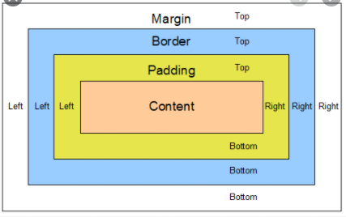

<h1>CSS-Margin&Paddings&Broder</h1>

## Vorwissen
- [Div-Boxen](./05_Floating.md)
- - [Div-Boxen](./03_CSS_DIV_boxes.md)

 
## Margins & Paddings

**Margins** 
- Die Berührungspunkte zwischen Zwei Elemette ist an den jeweilgen äußeren Grenzen der Margins 
- Margin ist der Abstand zwischen der "relativen Grenze = Border" und der Äußeren Grenze

**Padding** 

- Padding ist der Abstand zwischen der "relativen Grenze = Border" und dem eigentlichen Content= innerem Element

**Border** 
- Den konkreten Border kann man ebenfalls entsprechend konfiguieren. 

## Implementierungen von Margin & Padding
 Hier wurden weder Margin noch padding werte Geändert:

<iframe src="https://determined-varahamihira-d7b5b4.netlify.app/02_CSS/2.9+Margins" width="100%" height="30%"></iframe>  

 Hier wurden nur Margin werte geädert, somit verhalten sich die Boxen mit mehr abstand
 
<iframe src="https://determined-varahamihira-d7b5b4.netlify.app/02_CSS/2.9+Margins2" width="100%" height="30%"></iframe>  

 Hier wurden nur Padding werte geädert, somit ist der Inhatll innerhalb der boxen mit Abstand

<iframe src="https://determined-varahamihira-d7b5b4.netlify.app/02_CSS/2.10+padding" width="100%" height="30%"></iframe>  

 Hier wurden sowohl margin als auch Padding geändert

<iframe src="https://determined-varahamihira-d7b5b4.netlify.app/02_CSS/2.10+paddingMargin" width="100%" height="30%"></iframe>  

>

Hier wruden lediglich die Border geändert. Über den Border können auch 

<iframe src="https://determined-varahamihira-d7b5b4.netlify.app/02_CSS/2.11+border" width="100%" height="30%"></iframe>  
