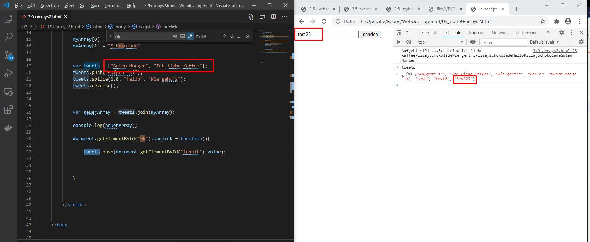

<h1>Variablen</h1>

# Beschreibung

Hier werden Variablen eingeführt. Bei Variablen werden "Dinge" zwischengespeichert. Somit können Variablen weiterverarbeitet, gespeichet oder ausgegeben werden.

Java-Script ist dynamisch typisiert.

## Implementierung

Hier die Basic-Implementierung von Variablen ohne Nutzerinteraktion

<iframe src="https://determined-varahamihira-d7b5b4.netlify.app/03_JS/3.8+variablen1"></iframe>  

Hier die Basic-Implementierung von Variablen MIT Nutzerinteraktion

<iframe src="https://determined-varahamihira-d7b5b4.netlify.app/03_JS/3.8+variablen2"></iframe>  

Hier wird eine Array-Interaktion dargestellt.
- Erstellen einer Array
- Hinzufügen von Inhalten
- log-Funktion = ausgabe von Array
- 

<iframe src="https://determined-varahamihira-d7b5b4.netlify.app/03_JS/3.9+arrays1.html"></iframe>  

Hier das obere Bsp etwas customized. Hierbei werden nun die Nutzerinteraktion von dem User in eine Array hinzugefügt:

dazu wird zu einer Array ein neuer Eintrag hinzugefügt = "push", gelöscht = "splice", LIFO/FIFO = POP usw. Hier die [Array-Funktionen](https://developer.mozilla.org/de/docs/Web/JavaScript/Reference/Global_Objects/Array)

<iframe src="https://determined-varahamihira-d7b5b4.netlify.app/03_JS/3.9+arrays2.html"></iframe>  

