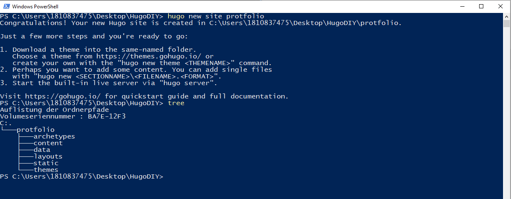

<h1>Create Site</h1>

Um nun eine Hugo Seite lokal erstmalig zu initalisieren wird der Befehl

> hugo new site *"Sitename"*
> hugo new site portfolio

Für diese Dokumentation wurde auf dem Desktop der Folder HugoDIY  angelegt. alle weiteren Webseit arbeiten wurden in diesem Folder ausgeführt.

Nach dem abgeben dieses Befehls entsteht folgende Ordner Struktur: 

└───protfolio
    ├───archetypes
    ├───content
    ├───data
    ├───layouts
    ├───static
    └───themes

 

Diese Ordner haben folgende Aufgaben:

## Archetype
Ablage der Tempaltes für Posts, und webseiten

## Config.Toml
Diese Datei ist die Grundlage Konfigurationsdatei für die Hugo Webseite

## Content
Hier wird der Inhalt der Seite erstellt und gepflegt. Diese Pflege geschieht via Markdown

## data 
Hier liegen Daten, welche von der Webseite genutzt werden können. BSP yaml, json etc

## Layout
Hier wird die Darstellung der Webseite lokal konfiguriert. Dies kann auch aus dem Ordner Themes kommen. Sind zu einem Object sowohl Daten im Theme alas auch ich Layout folder hinterlegt überschreiben die Layout Konfigurationen die Configs des Themes

## Static
Hier finden sich die Dateien aus CSS, JavaScript und CO 

## Themes
Hugo hat zahlreiche [Theme Vorlagen](https://themes.gohugo.io/). Diese können einfach heruntergeladen und über den Theme folder für das eigene Projekt zugänglich gemacht werden.
