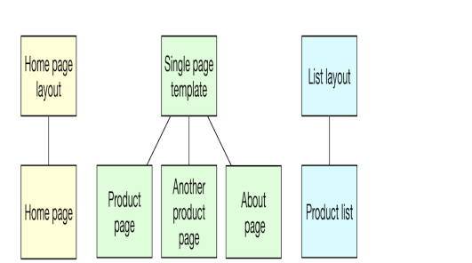
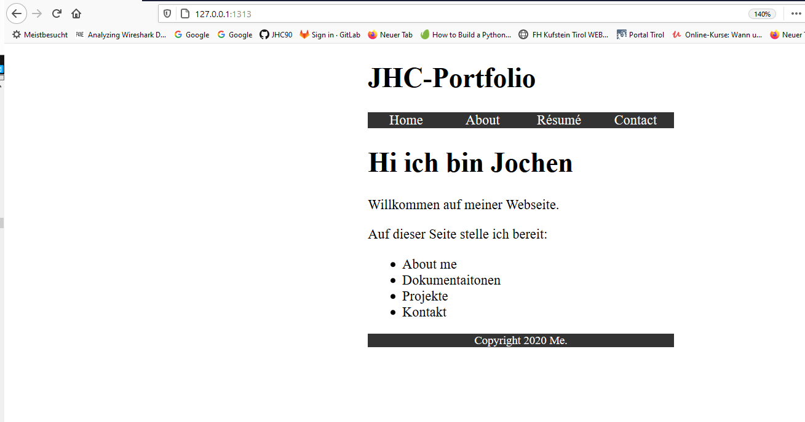
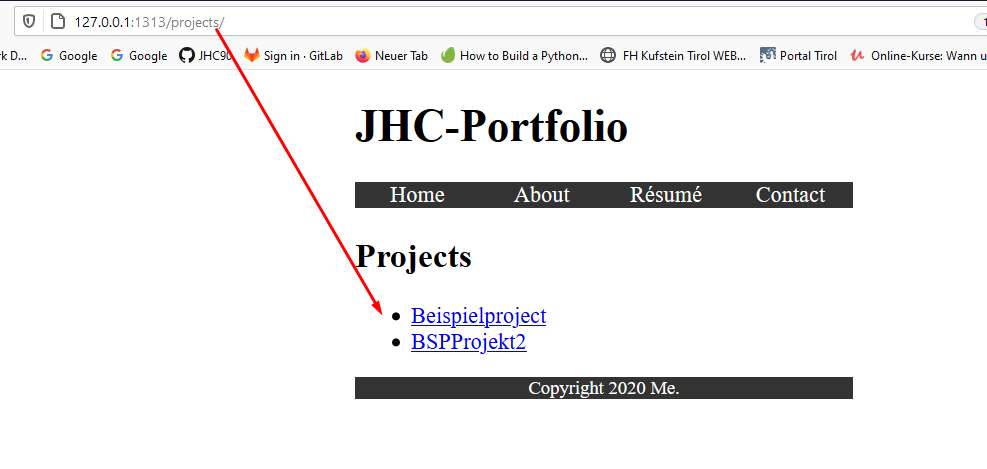
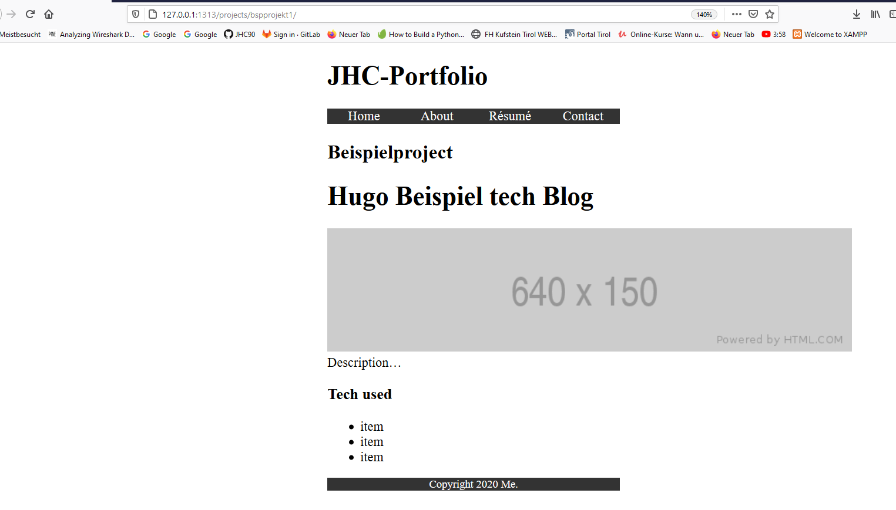
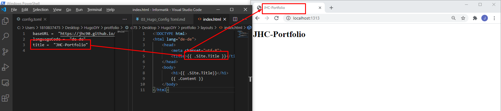
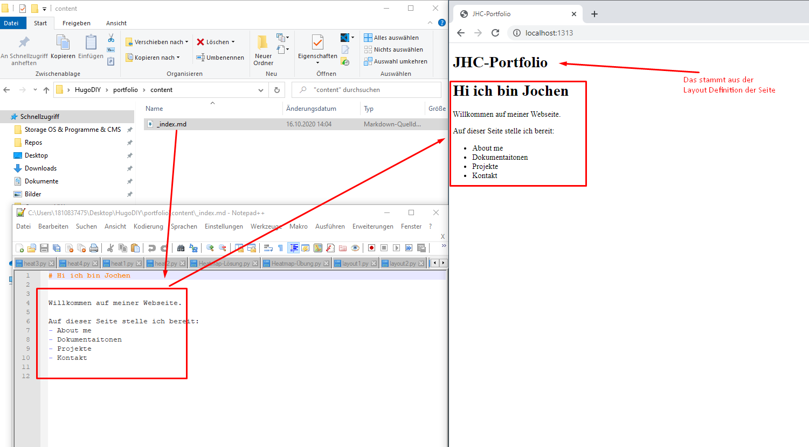
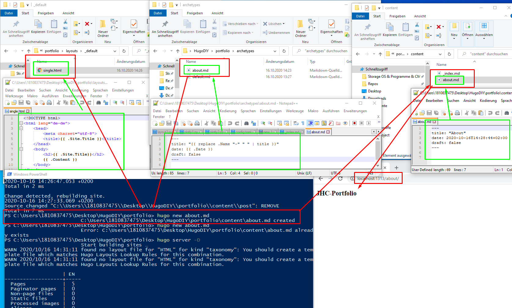

<h1>Layout - Homepage</h1>



In hugo werden unterschieldiche Layouts definiert, welche für unterschiedliche darstellungstypen verwendet werden. Die Homepage ist die erste Seite die aufgerufen wird und diese hat eine eigene Darsetllung. Die anderen Seiten werden via Archetypes zunächst definiert und jedes mal wenn eine neue Seite generiert wird, greift man auf diese Vorlagen zurück. 

## Vergleich der Seiten mit Beispiel

| _index.html                                                                      | list.html                                                                        | single.html                                        |   
|----------------------------------------------------------------------------------|----------------------------------------------------------------------------------|----------------------------------------------------|-
|                                                                                  |                                                                                  |                                                    |  
| Hier wird die Seite konfiguriert, welche beim Aufruf der root-URL angezeigt wird | HIer ruft man ein directory auf. Konkret wird eine Sammlung an Links dargestellt | HIer bezeihen wir uns auf direkteine Content seite |  


## Homepage
das ist die Basic-Index. Die wird in Hugo anders gepflegt als die restlichen Seiten. Diese wird unter dem Pfad

>layouts/index.html

gepflegt.


```html
<!DOCTYPE html>
<html lang="de-de">
    <head>
        <meta charset="utf-8">
        <title>{{ .Site.Title }}</title>
    </head>
    <body>
        <h1>{{ .Site.Title}}</h1>
        {{ .Content }}
    </body>
</html>
```

aus dem oberen HTML-Chunk ist abzuleiten, dass der Title aus dem Config toml in die Index, in die Darstellung übertragen wird
.

Der Teil **{{ .Content }}** kommt nun aus einem eigens dafür angelegeten Markdown, welche unter dem Pfad ./content/_index.md gepflegt wird




## Pages & Posts
Diese Content-Seiten werden über Vorlagen = Archetypes definiert. 

Ist ein Archetype für einen Seitentyp definiert kann mit einem einfachen Befehl direkt eine neue Content Seite angelegt werden. BSP ist hier der Archetype **post** definiert. Somit kann eine Content Seite nach diesem Muster Problemlos erstellt werden.

Neben den Archtype muss aber auch wieder ein Layout definiert sein

Um nun Inhalt für Singlepages bereitzustellen brauchen wir:

1. ein Layout
2. einen Archetype
3. Befehl
   >hugo new Inhalt.md
   >hugo new about.md
4. Definition des Inhalts=Content 


