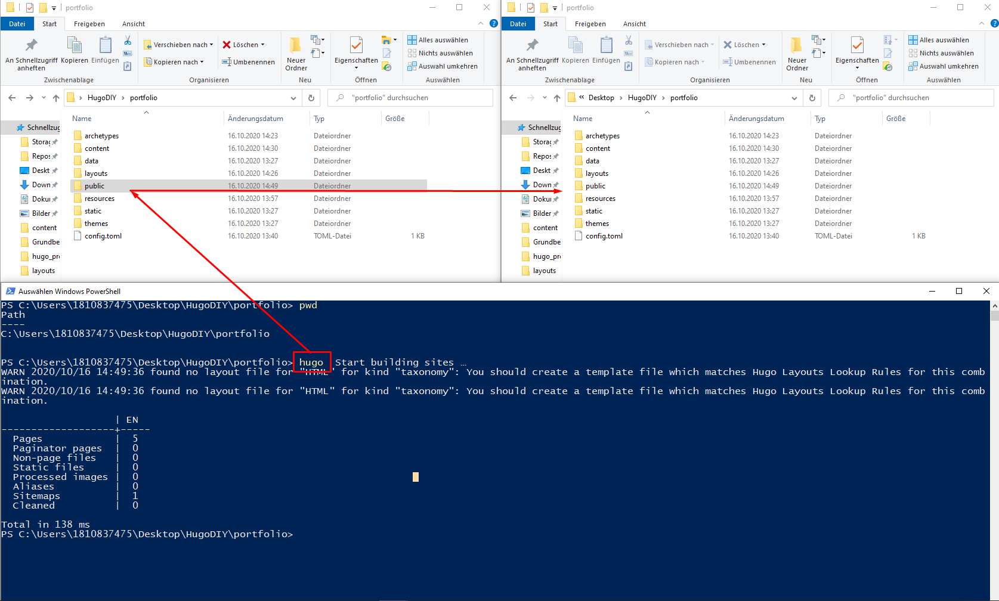

<h1>Deployment</h1>

um nun aus der Struktur aus Markdown ein "deplyoable" HTML Struktur zu gestallten kann nun mit dem Befehl

> hugo

eine komplette Struktur erstellt werden, weche auf diese Art einfach auf einen Webserver deployt werden kann.

# Github-Pages
Eine mögliche Version für ein Deployment sind [github-Pages](https://pages.github.com/)

