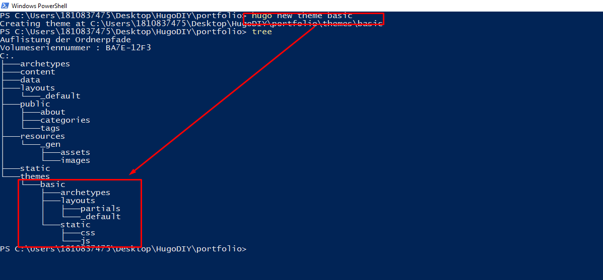

<h1>Themes</h1>

die miniamlistische Struktur eines Themes besteht aus folgender Struktur


```
layouts
├── _default
│   ├── list.html
│   └── single.html
└─── index.html
```

In diesem Teil wollen wir jedoch ein extended Theme selbst erstellen.

> hugo new theme basic



# Wrap up
1) in den vorherigen Kapiteln hatten wir kein Theme verwendet. Die Layout Informationenkamen aus 
   1) portfolio/archetypes
   2) portfolio/layouts/index.html
   3) portfolio/_default/_default.html
2) Der Ordner **themes** war bisher leer
-----

3) durch den Command
   > hugo new theme basic

   wurde die Theme Struktur erstellt. Die Theme Strukut hat ihre **eignen Folder** für 
   - Archtypes
   - Layouts

    Was das theme nicht hat ist:
    - content

4) startet man den Server lokal, so erkennt man dass nach wie vor die alten muster und nicht die des Themes verwendet werden. Das bedeutet tortz der Existenz der Theme data werden die Information durhc die Layout & Archetype information außerhalb des Themes überschrieben. Wenn die Information außerhalb nicht exsitieren werden die Theme Konfigurationen verwendet.

5) 

Solange

## Einbinden des Themes in die Webseite
Dazu muss in der config.toml der Verweis auf das Theme hinterleg sein

```
baseURL =  "https://jhc90.github.io/"
languageCode =  "de-de"
title =  "JHC-Portfolio"
theme = "basic"
```
