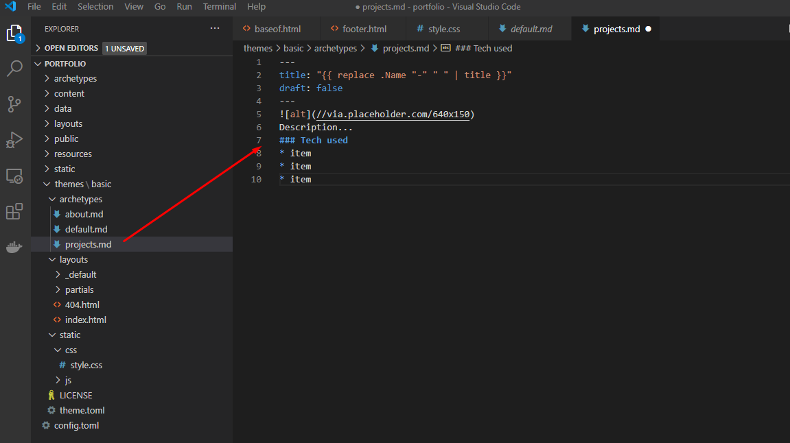
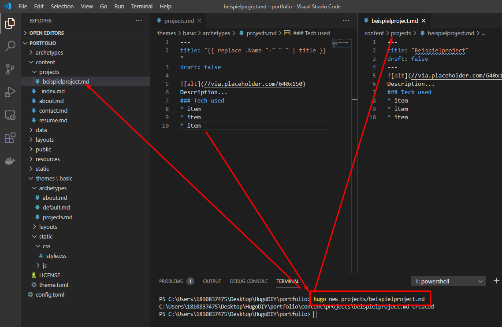

<h1>Archtypes</h1>

Archtypes sind Vorlagen für bestimmte Seiten-Typen. Archtypes können nach belieben angelegt werden.

Archtypes finden sich sowohl in den Themes als auch in dem normalen Projektfolder. 

## Erstellen eines neuen Archtypes
1. Erstellen der Datei und befüllen mit dem geünschten Inhalt
   
2. Verwenden einer neuen content seite mit dem Archtype

3. Die Seite ist auch direkt in der lokalen Entwicklung unter 
> http://127.0.0.1:1313/projects/beispielproject/

erreichbar

und nun ist die Beispielseite hinterlegt

----
Zusammenfassung
 Mit Archtypes gibt es Vorlagen, die dabei helfen schnell und effizient Inhalte nach einem bestimmten Muster aufzubereiten