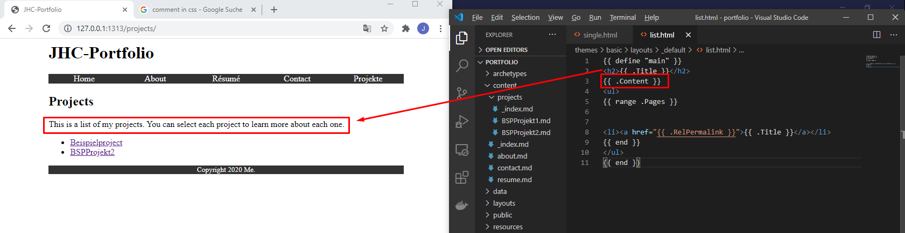

<h1>List Pages-Layout</h1>

    

Hiermit wird es emöglicht, dass ein Directory im Folder content angezeigt und somit der gesamte inhalt angezeigt werden kann. Das legt man einmalig für die Webseite an und damit ist dieses Tool für alle Directories vorhanden

Dazu muss die datei:

>thems/layouts/_default.html

mit dem Inhalt
```html
{{ define "main" }}
<h2>{{ .Title }}</h2>
<ul>
{{ range .Pages }}
<li><a href="{{ .RelPermalink }}">{{ .Title }}</a></li>
{{ end }}
</ul>
{{ end }}
```

angelegt sein

-----

## Adding content to List pages

Um nun eben diese List-Page zu überarbeiten muss nun eine Datei **_index.md** in den folder angelegt werden.

BSPW
hugo new projects/_index.md

mti dem Inhalt:
```html
---
title: "Projects"
draft: false
---
This is a list of my projects. You can select each project to learn more about
each one.

```

um diesen Inhalt nun wieder darzustellen muss auch das entsprechende Layout passend zu der liste gepflegt werdn. Eine Webseite besteht immer aus einem Layout & content

> thems/layout/_default/list.html



-----

## Nun kann man das ganze auch Sektionsspezifisch machen und nur das Menu für die Projekte apassen:

Hierfür muss nte r/themes/Layout/projects die Datei list.html angelgt werden.
