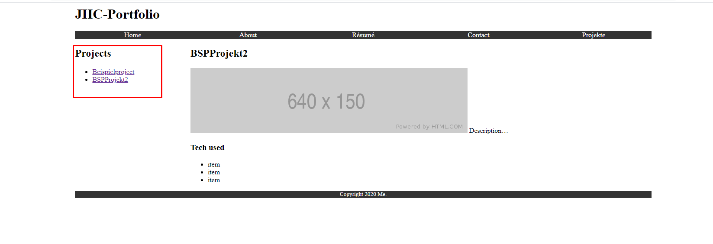
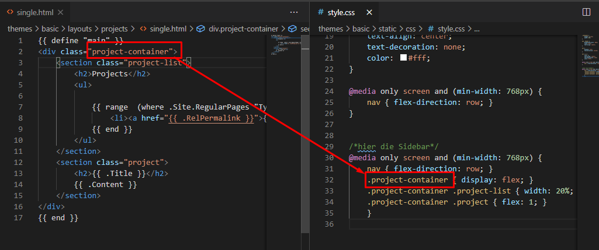

<h1>Special Layout</h1>

 hier ist es das Ziel, dass die Rubrik Projekte ihre eigene Aside-Navigaion bekommt. Dazu sollen immer alle content makrdown files in Content/projekte aufgegriffen werden und über die Projekt-Navigaion hinweg eingebunden werden

 

 Dieses Layout ist spezifisch für die Sektion projekte.

 1) erstelle Folder für spezfische Sektion
 >  mkdir themes/basic/layouts/projects/

 2)  Erstelle single.html für die Sektion
   >  touch themes/basic/layouts/projects/single.html

   mit dem Inhalt

   ```html
   {{ define "main" }}
        <div class="project-container">
            <section class="project-list">
                <h2>Projects</h2>
                <ul>
                    
                    {{ range  (where .Site.RegularPages "Type" "in" "projects") }}
                        <li><a href="{{ .RelPermalink }}">{{ .Title }}</a></li>
                    {{ end }}
                </ul>
            </section>
            <section class="project">
                <h2>{{ .Title }}</h2>
                {{ .Content }}
            </section>
        </div>
    {{ end }}
   ```

   Wobei die ausgabe spezfiziert werden kann mit bspw:
   - >{{ range (where .Site.RegularPages "Type" "in" "projects") }}
   - >range (where .Site.RegularPages "Type" "in" "projects").ByDate.Reverse
   - >range first 1 (where .Site.RegularPages "Type" "in"
"projects").ByDate.Reverse

3) zuletzt kann die spezifische Site Navigaion  noch im css file modifziert werden



mit dem Inhalt

```html
@media only screen and (min-width: 768px) {
    nav { flex-direction: row; }
    .project-container { display: flex; }
    .project-container .project-list { width: 20%; }
    .project-container .project { flex: 1; }
    }
```

