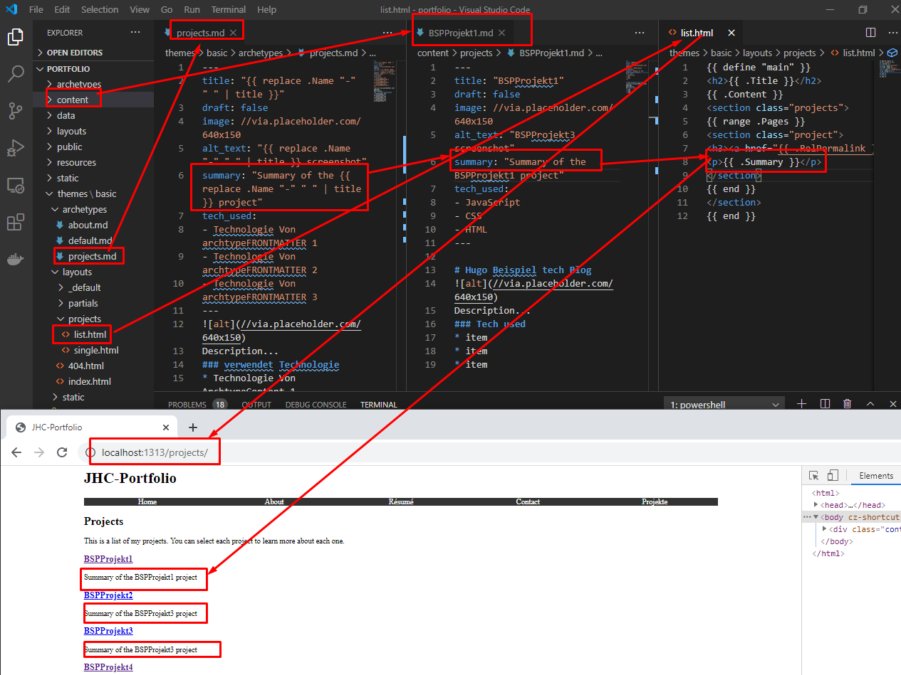

<h1>Data</h1>

Hier die möglichen Datenquellen für eine Webseite:

 1. Metadaten aus der Config-toml

Auf diese Art wird dann auch Google-Analytics eingebunden

 2. [Front Matter](./05_Hugo_Front_Matter.md)
   BSP archtype Projects.

   Archtypes sind die erste Grundlage für Content und können erheblich komplexer werden und Daten aus der Config toml und dem Create Command übernehmen. 
   Dazu muss aber auch entsprechend das jeweilige Layout wissen, wo es hierbei zugreifen muss. 
   Es muss gepflegt sein
   - Archtype
   - layout (default bzw Project Layout entsprechend die Single-Page)
   - Aus dem Archtype im Frontmatter kann information erfolgen. Besonders hilfreich wenn alle Projektseiten die gleiche Infoa beherbern sollen
   - Im Screenshot unten Hardcoded Info vs FrontMatter infoauslesen 

   

3. Erweitern der Informationen von List-Pages um die Summary INFO
   1. Update Layout der jeweiligen Page
   2. prüfen dass die Information in der Seite content hinteregt ist
   3. ggf im Archtype hinterlegn
   4. ggf in der Config hinterlegen

4. Bedingtes Anzeigen von INhalten
   Hierbei wird erst geprüft ob ein Inhalt besteht. Wenn der Inhalt besteht kann dieser Aufgegriffen und verwendet werden. Hugo hat hierfür die isset Bedingung

   
   
   Ist nun auf einer List-page eine Desctiption Information hinterlegt, so wird diese übernommen. Ist keine spezielle Description hinterlegt, so wird die List-Site description übernommen.

   Das ganze kann dann im nächsten Schritt für weitere Meta-Tags verwenet wertden. BSP den title in dem Partial head. html
   

5. Data-Dirtectory
Hier können files als
- JSON
- TOML
- YAML
  hitnerlegt sein
 
 Bsp 
 - ablage einer JSON datei kontatk in Data
 - Customized Page für contats => das layout liegt lokal unter layouts und nicht in Themes/layout
 > touch portfolio/layouts/_default/contact.html

 

 6. Laden von Remote Webseiten ~ mach ich nicht fertig derweil
   Einbinden der Github-URL
     1) Daten in der TOML hinterlegen
     2) Erstellen eines Layout files 
     3) touch layouts/_default/opensource.html

7. LAden von rss
8. 