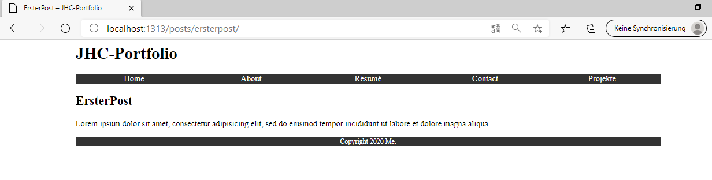
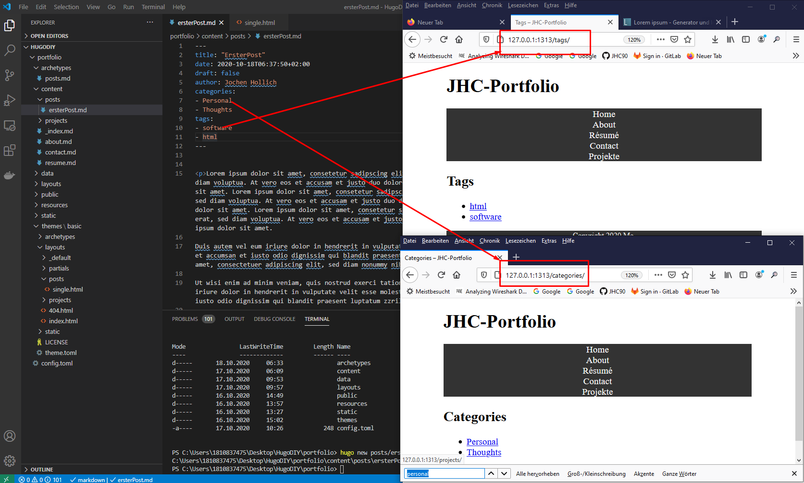

<h1>Blog</h1>

- Vorteile eigener
  - Messe die Interaktion


HUgo contetn type post
   - Title
   - author
   - content

Steps
1. Create Archtype /posts.md
```html
---
title: "{{ replace .Name "-" " " | title }}"
date: {{ .Date }}
draft: false
author: Jochen Hollich
---


Lorem ipsum dolor sit amet, consectetur adipisicing elit, sed do eiusmod
tempor incididunt ut labore et dolore magna aliqua
```
2. Generate Post & Check in Webbrowser
  > hugo new posts/ersterPost.md

  

3. Erstelle post layout
> mkdir themes/basic/layouts/posts
> touch themes/basic/layouts/posts/single.html

mit dem Inhalt 

```html
{{ define "main" }}
<article class="post">
    <header>
        <h2>{{ .Title }}</h2>

        <p>
      Reading time: {{ math.Round (div (countwords .Content) 200.0) }} minutes.
    </p>
    </header>
    <section class="body">
        {{ .Content }}
    </section>
</article>
{{ end }}
```

In diesem Block wird sowohl der Author als auch die Reading time ermittelt

4. Tags & Categories & Taxonomies
werden im Front Matter eines Beitrags gepflegt


können als toml oder json gepflegt werden. Sobald die angelegt sind gibt es webseiten, nach denen man die spezfischen Seiten aufrufen kann:



Taxonomy = logisches Gruppieren von Posts
Im Kontext von Hugo bezieht sich der Begriff Taxonomies darauf wenn man nach einem bestimmten Tag-Begriff sucht

um die Tag Seiten zu Adaptieren gehe wie folgt vor
     1. touch themes/basic/layouts/_default/tag.terms.html
  
     ```html
      {{ define "main" }}
      <h2>{{ .Title }}</h2>
      {{ .Content }}
      {{ range .Data.Terms.Alphabetical }}
      <p class="tag">
        <a href="{{ .Page.Permalink }}">{{ .Page.Title }}</a>
        <span class="count">({{ .Count }})</span>
      </p>
      {{ end }}
      {{ end }}
     ```


    2. > hugo new tags/_index.md
   

     legt eine Seite an, welche dann erscheint wenn man nach den Tags sucht => kann nun bearbeite werden
     

  5. Permalinks
    - config.toml
    [permalinks]
      posts = "posts/:year/:month/:slug/

      

    das sind links die immer auf die jeweilige Seite zeigen

  6. Sortieren nach parmalinks Jahr und Monat
- config.toml

```
[params]
    author = "Jochen Hollich"
    description = "My portfolio site"
    gh_url = "https://api.github.com/users"
    gh_user = "JHC90"

[permalinks]
    posts = "posts/:year/:month/:slug/"
    year = "/posts/:slug/"
    month = "/posts/:slug/"
    

[taxonomies]
    year = "year"
    month = "month"
    tag = "tags"
    category = "categories"
  
```

- 


1. Customized Blog List Page
2. Ziel ist es nun die List-Pages aus 5 zu customizen
 - themes/basic/layouts/partials/post_summary.html

  ```html
  <article>
      <header>
          <h3>
              <a href="{{ .RelPermalink }}">{{ .Title }}</a>
          </h3>
          <time>
              {{ .Date | dateFormat "January" }}
              {{ .Date | dateFormat "2" }}
          </time>
      </header>
      {{ .Summary }}
  </article>
  ```

  > themes/basic/layouts/posts/list.html


  ```
  {{ define "main" }}
<h2>{{ .Title }}</h2>
{{ range .Pages }}
{{ partial "post_summary.html" . }}
{{ end }}
{{ end }}
  
  ```

  Dieser Teil geht nur für posts, möchte man das auch für Tags, & Taxonomien machen mussman das sepeart fafür anlegen

  > cd  themes/basic/layouts
  > cp posts/list.html _default/year.html
  > cp posts/list.html _default/month.html


