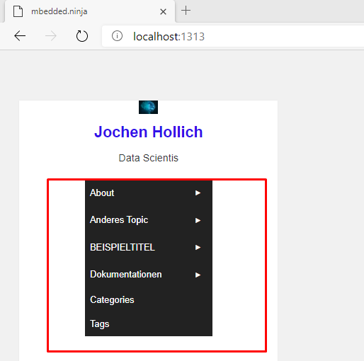
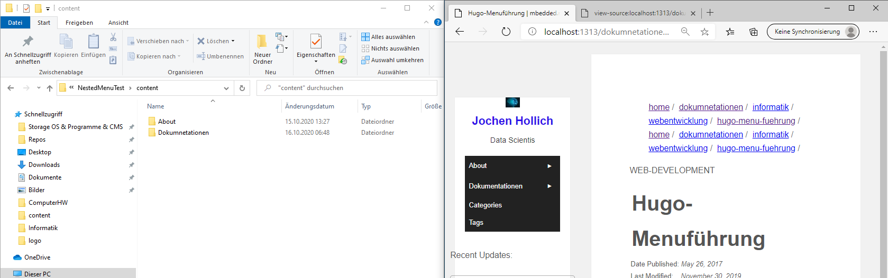
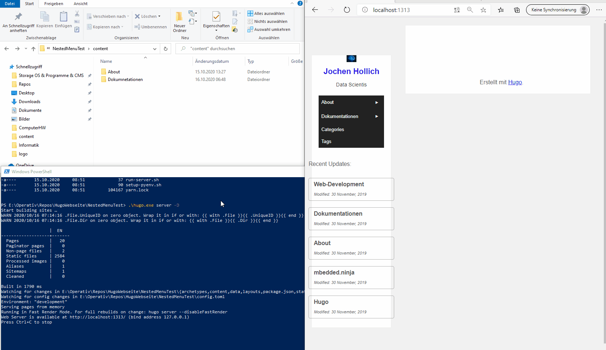
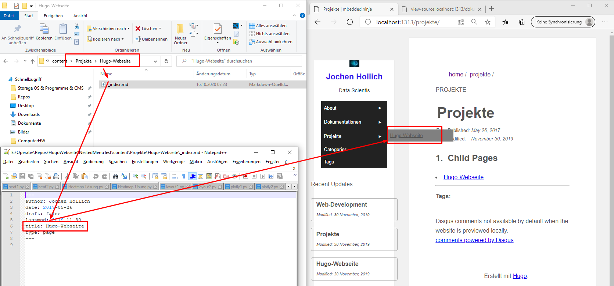

# Hauptmenüpunkte Der Webseite

Ind diesem Teil wird die Erstellung der Menüführung und somit die Strukturierung de rvorliegenden Webseite dokumentiert. Konkret geht es um die Webdarstellung:



1. der gesamte Inhalt, welcher auf dem Block dargestellt werden soll ist in dem lokalen Menü **./content** hinterlegt


2. Möchte man auf dieser Ebene eine neuen Menüpunkt hinzufügen, so müssen folgende Schritte beachtet werden:
   1. Erstelle einen neuen Ordner
   2. Wechsel in den Ordner
   3. Erstelle der **_index.md** mit folgendem Content:
   ```
   ---
    author: Jochen Hollich
    date: 2017-05-26
    draft: false
    lastmod: 2019-11-30
    title: TITEL DER SEITE
    type: page
   --- 
   ```
3. Server neustarten

Hier eine gif zur Erstellung einer Hauptmenüstruktur:



# Submenüpunkte der Webseite

Um nun Sub-Menütpunkte zu erstellen gehen wird Identisch vor wie bei der Hauptmenüerstellung, lediglich navigieren wir zuvor in den gewünschten Ordner, wo das Submenü erstellt werden soll:

BSP:
- Content
  - Projekte
    - Hugo-Webseite
      - _index.md




# _index.md
Zu jedem Hauptmenüpunkt und zu jedem Submenüpunkt wird somit eine entsprechende _index.md Datei angelegt. Somit kann später auch auf die entsprechenden Struktuierungspunkte geklickt werden und es öffnet sich die jeweilige "Kategorie-Index-Seite". Somit kann bspw. der Reiter Hugog direkt erklrät werden


