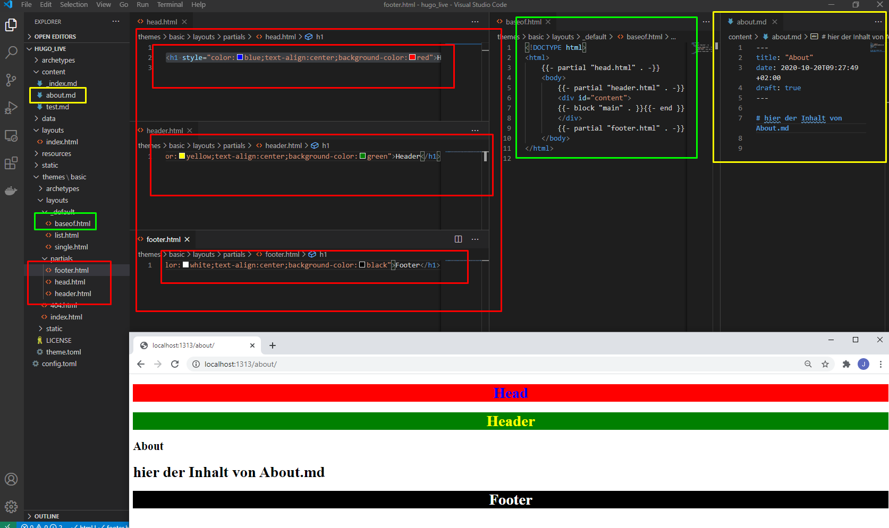
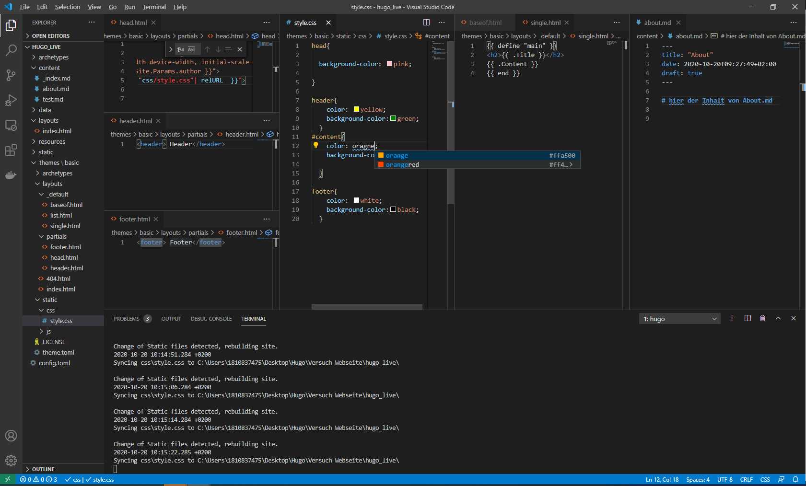
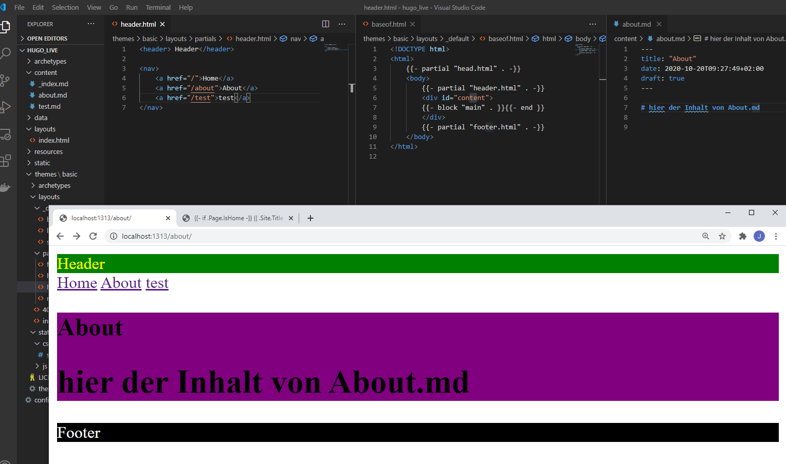
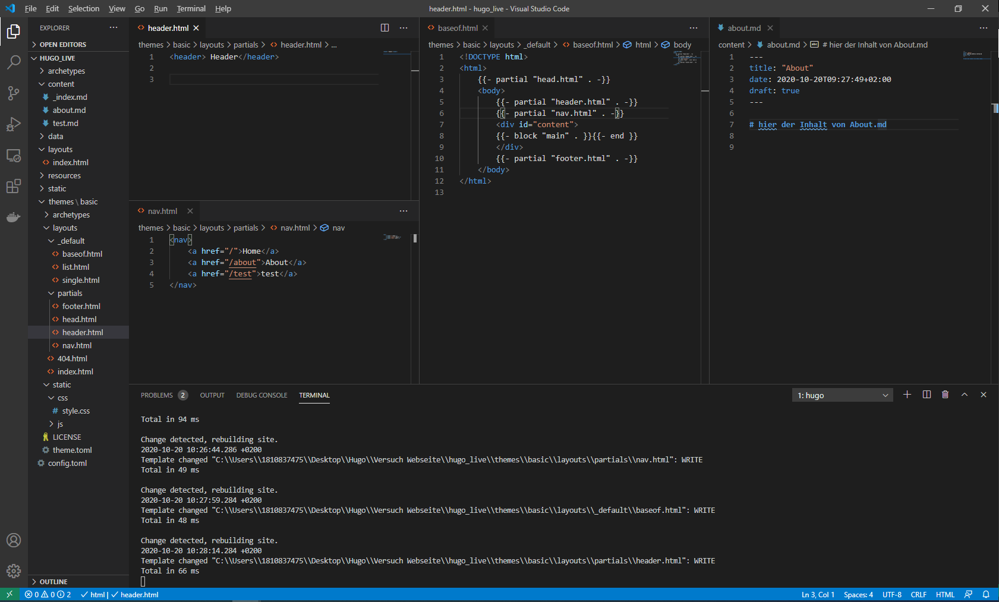
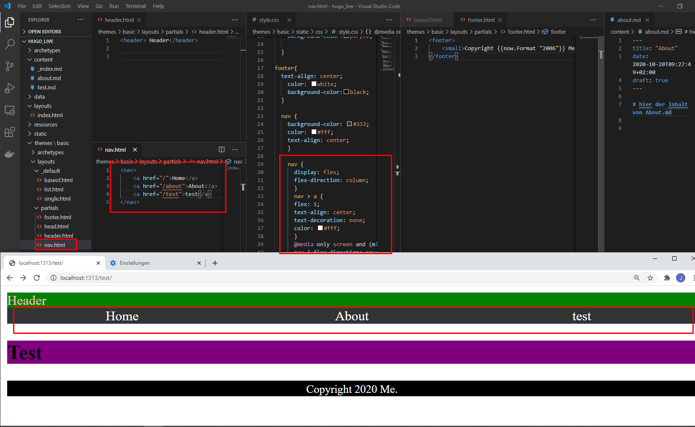
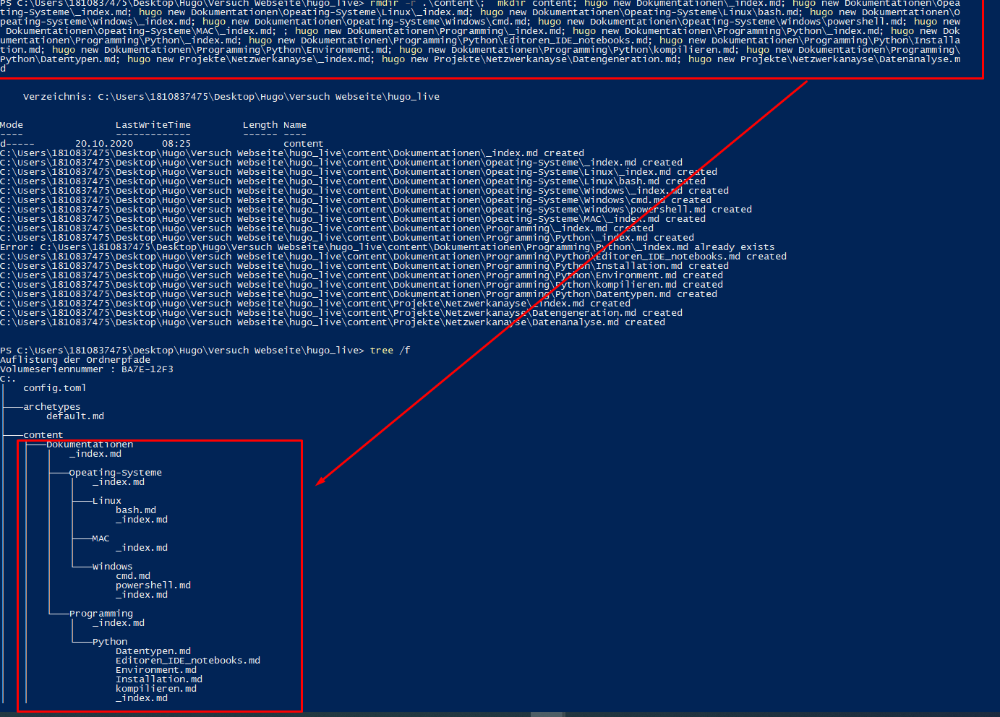
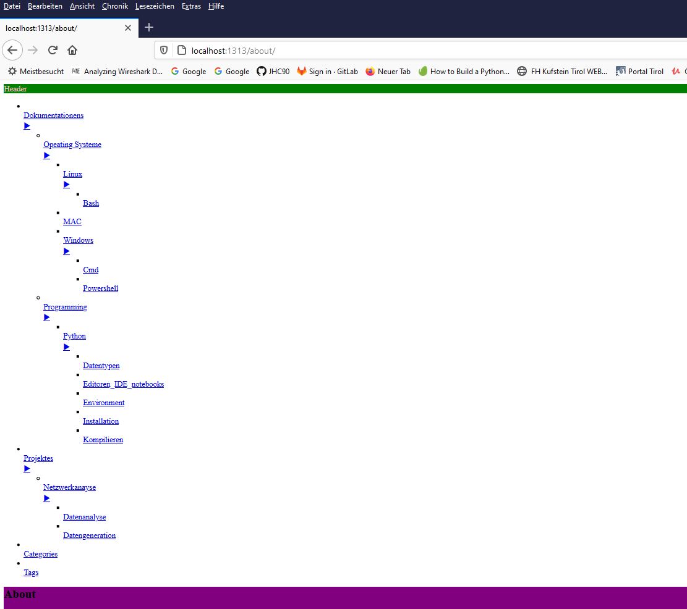
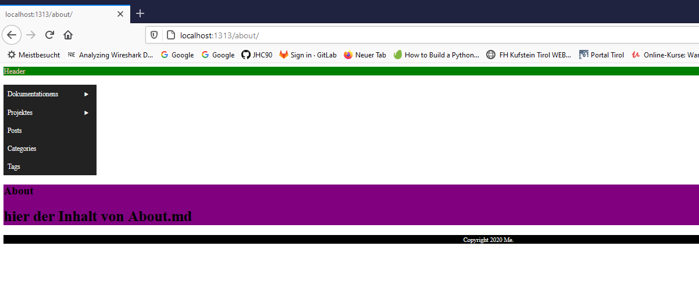

1) mkdir hugo_live
2) hugo new site hugo_live --force
3) cd hugo_live
4) tree
5) tree /f
6) hugo server -D => leere Seite aber keinen Fehler


# Erstelle eigenes Theme
1. >hugo new theme basic
2. HInzufügen des Themes in die config.toml
    >theme = "basic"
  
    Testen ob server läuft => Es sollte kein 404 kommen

 # Erstelle Website index
 > touch ./layouts/index.html 
 
 mit dem sourcecode folgender HTML [Inhalt](https://determined-varahamihira-d7b5b4.netlify.app/hugo/layouts/index.html)

 > touch ./conent/_index.md 
 
mit minimalem MARKDOWN Inhalt

Testen ob server läuft =>nun sollte die Index auf die URL angezeigt werden

# default Pages NICHT posts

# Erstelle Sub-Pages Website
1. Definiere in der [themes/basisc/layouts/Single.html](https://determined-varahamihira-d7b5b4.netlify.app/hugo/themes_basic_layouts/_default/single)
   ```html
   {{ define "main" }}
    <h2>{{ .Title }}</h2>
    {{ .Content }}
    {{ end }}
   ```
2. Erstelle neue Seiten
> hugo new about.md
> hugo new test.md

Test ob die Seiten dargestellt werden


# Einbinden der partials
Paritals = inhalt de rjeweiligen rubrik 
baseof = grundsätzliches aussehen
single.html = übergang von Markdown zu html


am oberen Bsp sieht man wie die Partials(Head, Header, Footer) über das Baseof mit dem Contetn die Seite erstellen

Erweiterung mit der CSS


Erweiterung mit einfacher Menüführung mit Liste


Auslagern der Nav in eigenes Partial, das muss dann wiederum imBaseof eingebunden werden


formatierung der Nav in css



----
Bis hierher haben wir nun eine Statische Navigation via nav.html erreicht. Im weiteren wollen wir eine dynamische Navigation haben. Das beduetet, dass wenn ein neuer Artikel in die Content Serie erstellt wird, wird dieser autoamtisch in die Navigation übertragen. Das ganze ist außerdem unendlich in die Tiefe geschachtelt

1. löschen der bisherigen nav.html
2. erstelle menu.html
3. erstelle menu_recursive.html
4. erstelle geschachtelten Content


# Erstelle etwas Inhalt mit Struktur
- hugo new Dokumentationen\_index.md
- hugo new Dokumentationen\Opeating-Systeme\_index.md

- hugo new Dokumentationen\Opeating-Systeme\Linux\_index.md
- hugo new Dokumentationen\Opeating-Systeme\Linux\bash.md

- hugo new Dokumentationen\Opeating-Systeme\Windows\_index.md
- hugo new Dokumentationen\Opeating-Systeme\Windows\cmd.md
- hugo new Dokumentationen\Opeating-Systeme\Windows\powershell.md

- hugo new Dokumentationen\Opeating-Systeme\MAC\_index.md
- 
- hugo new Dokumentationen\Programming\_index.md
- hugo new Dokumentationen\Programming\Python\_index.md

- hugo new Dokumentationen\Programming\Python\_index.md
- hugo new Dokumentationen\Programming\Python\Editoren_IDE_notebooks.md
- hugo new Dokumentationen\Programming\Python\Installation.md
- hugo new Dokumentationen\Programming\Python\Environment.md
- hugo new Dokumentationen\Programming\Python\kompilieren.md
- hugo new Dokumentationen\Programming\Python\Datentypen.md

- hugo new Projekte\Netzwerkanayse\_index.md
- hugo new Projekte\Netzwerkanayse\Datengeneration.md
- hugo new Projekte\Netzwerkanayse\Datenanalyse.md

**Bash**
```bash
hugo new Dokumentationen\_index.md && hugo new Dokumentationen\Opeating-Systeme\_index.md  && hugo new Dokumentationen\Opeating-Systeme\Linux\_index.md && hugo new Dokumentationen\Opeating-Systeme\Linux\bash.md  && hugo new Dokumentationen\Opeating-Systeme\Windows\_index.md && hugo new Dokumentationen\Opeating-Systeme\Windows\cmd.md && hugo new Dokumentationen\Opeating-Systeme\Windows owershell.md  && hugo new Dokumentationen\Opeating-Systeme\MAC\_index.md &&  && hugo new Dokumentationen rogramming\_index.md && hugo new Dokumentationen rogramming ython\_index.md  && hugo new Dokumentationen rogramming ython\_index.md && hugo new Dokumentationen rogramming ython\Editoren_IDE_notebooks.md && hugo new Dokumentationen rogramming ython\Installation.md && hugo new Dokumentationen rogramming ython\Environment.md && hugo new Dokumentationen rogramming ython\kompilieren.md && hugo new Dokumentationen rogramming ython\Datentypen.md  && hugo new Projekte\Netzwerkanayse\_index.md && hugo new Projekte\Netzwerkanayse\Datengeneration.md && hugo new Projekte\Netzwerkanayse\Datenanalyse.md 
```

**Powershell**
```powershell
rmdir -r .\content\;  mkdir content; hugo new Dokumentationen\_index.md; hugo new Dokumentationen\Opeating-Systeme\_index.md; hugo new Dokumentationen\Opeating-Systeme\Linux\_index.md; hugo new Dokumentationen\Opeating-Systeme\Linux\bash.md; hugo new Dokumentationen\Opeating-Systeme\Windows\_index.md; hugo new Dokumentationen\Opeating-Systeme\Windows\cmd.md; hugo new Dokumentationen\Opeating-Systeme\Windows\powershell.md; hugo new Dokumentationen\Opeating-Systeme\MAC\_index.md; ; hugo new Dokumentationen\Programming\_index.md; hugo new Dokumentationen\Programming\Python\_index.md; hugo new Dokumentationen\Programming\Python\_index.md; hugo new Dokumentationen\Programming\Python\Editoren_IDE_notebooks.md; hugo new Dokumentationen\Programming\Python\Installation.md; hugo new Dokumentationen\Programming\Python\Environment.md; hugo new Dokumentationen\Programming\Python\kompilieren.md; hugo new Dokumentationen\Programming\Python\Datentypen.md; hugo new Projekte\Netzwerkanayse\_index.md; hugo new Projekte\Netzwerkanayse\Datengeneration.md; hugo new Projekte\Netzwerkanayse\Datenanalyse.md
```




Danach sieht die Navigation wiefolgt aus



Diese verschachtelte Navigation kann nun problemlos in css zu einem MerhschichtigenLayout konfiguriert werden:


 Verschachtelte Navigation css
 >touch static/styleMenu.css
    Füge menü css in der baseof ein



Ab nun wird das Menü dynamisch nach dem Anlegen der Markdowns in der ordner sruktur erstellt. Sprich werden neue strukturen wie
>hugo new Impressum\Adresse.md
>hugo new Impressum\Telefon.md

So werden diese Informationen 1:1 in die Navigaion übernommen


# Erstelle neue Inhatl
## Pages bzw Posts
>hugo new posts/_index.md


# binde Navigation auch auf der Hauptseite ein

