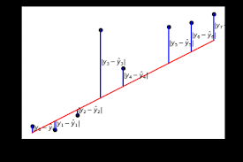
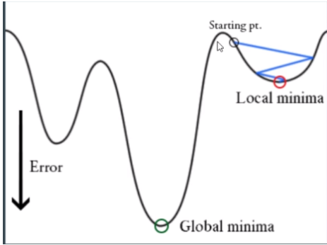
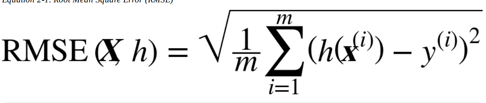

'''''
{
"title": "Regression-Performance",
"keywords": "Regression, RMSE, MAE, MSE",
"categories": "Data-Science, Regression, RMSE, MAE, ",
"description": "Auf dieser Page betrachten wir die Mögölichkeiten Regressions Fragestellungen zu messen. Dabei betrachten wir MAE, MSE und RMSE ",
"level": "Performance-Measure-Regression"
}
'''''
<h1>Performance Measure - Regression</h1>

Bei der Regression geht es um die vorhersage eines 

Ziel ist es die Summe der Fehler so gering wie möglich zu halten. Hierbei können unterschiedliche Kennzahlen verwendet werden. Welche Kennzahlen verwendet werden hängt von den zugrundeliegenden Daten ab. (Verteilung/Anzahl & Höhe von Ausreißern)
Dazu können folgende Kennzahlen verwedet werden. Sowohl der RMSE als auch der MAE sind Möglichkeinten die Distanz zwischen unterschieldichen Vektoren zu messen. 

Die Ausgangsiituation ist, dass man eine supvercised Datenlage hat. Es werden anschließend Predictions geätigt und mit den realen werten verglichen. Diese Predcitions können Höher, gleich oder niedriger als der Reale wert sein. Ziel ist es so nah wie möglich an den Fehler = 0 heranzukommen. 
Anders ausgedrückt ist der Fehler die Summe aller Abweichungen. Die folgnede Grafik zeigt ein Model = rote Linie. Dieses Modell weicht von den Realen Werten ab, dies wird mit den Blauen Linien dargestllt. 

Obere Visualisierung lässt sich nun in eine Fehlerfunktion darstellen. Sprich die folgende Grafik "gehört" zu der oberen Grafik. Es wird aber hierbei der Fehler beschrieben:

Wir versuchen durch die Optimierung(=suchen nach dem Minimum) der Fehlerfunktion jene Parameer zu finden, bei welchem die Fehlerfunktion minimal ist. 

Dieser Fehler kann nun auf unterschiedliche Weisen berechnet werden. Dabei 

## Mean-Absolute Error = MAE

Wie oben erwähnt können die Fehler größer, kleiner oder gleich = 0 sein. Nachdem in der einfachen Summation sich postivie und negative Werte aufheben, werden beim MAE lediglich die Beträge der Fehler aufsummiert. 

Der MAE ist gut wenn:

## mean-Squarred Error

Im Gegensatz zum MASE werden beim 

DER MAE hat das Problem, dass dieser im Vegleich zur Datenbasis quadriert ist. Somit ist der Wert zunächst nicht direkt vergleichbar

## Rooted-Mean-Sqared-Error = RMSE
Beim RMSE wird die Standardabweichung der Fehler von Prognosen verwendet. Somit werden innerhalb der ersten Standarabweichung 

DER RMSE stellt die Euclidsche Distanz dar.

