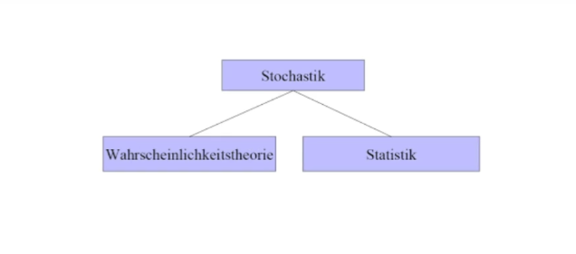

'''''
{
"title": "Statistic Basics - Definitionen",
"keywords": "Statistic-Basics",
"categories": "",
"description": "Hier die Erklärung meiner Webseite",
"level": "10",
"pageID": "07112020200718-StatisticsBasicsDefinitionen"
}
'''''

# Wahrscheinlichkeit und Statistik

Stochastik ist der Überbegriff für die Kombination aus Statistik und Wahrscheinlichkeitstheorie

## Statistik
“was kann ich über eine Population wissen, wenn es mir nicht möglich ist, jedes Mitglied zu erreichen? Statistik ist die Anwendung dessen von dem was wir wissen auf das was wir wissen wollen

## Wahrscheinlichkeiten
Wahrscheinlichkeiten helfen uns dabei, zu wissen, wie sicher wir in unserer Annahme sein können. Die Wahrscheinlichkeit ist ein Wert zwischen 0 und 1, bei dem ein bestimmtes Ereignis eintritt. 