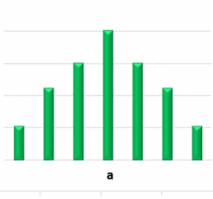
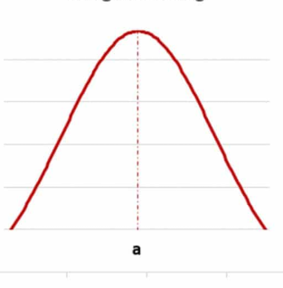

# Verteilungen

Eine Verteilung beschreibt alle wahrscheinlichen Ergebnisse einer Variablen.

# Diskrete Verteilung
In einer diskreten Verteilung muss die Summe aller einzelnen Wahrscheinlichkeiten gleich 1 sein

1. Gleichverteilung
2. Binominalverteilung
3. Poisson-Verteilung

# kontinuierlichen Verteilung
In einer kontinuierlichen Verteilung ist die Fläche unter der Wahrscheinlichkeitskurve gleich 1

1. Normalverteilung
2. ExponentialVerteilung
3. Betaverteilung

#
Diskret = endlich
Konitiuierlich = unendlich