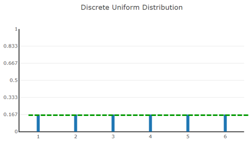

# Gleichverteilung

Das Werfen eines Würfels hat 6 diskrete, gleichverteilte mögliche Ergebnisse
Du kannst eine 1 oder 2, aber nicht eine 1,5 werfen
Die Wahrscheinlichkeiten, dass eine bestimmte Augenzahl gewürfelt wird, ist für alle Zahlen gleich, die Zufallsvariable ist diskret gleichverteilt.

Wahrscheinlichkeitsverteilung der diskreten Zufallsvariablen “Würfelwurf“.

Alle Balken sind gleich hoch und ergeben zusammen 1

