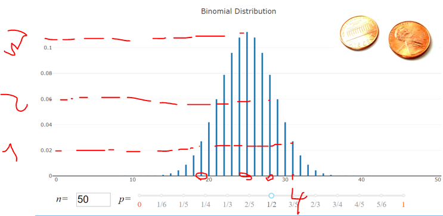
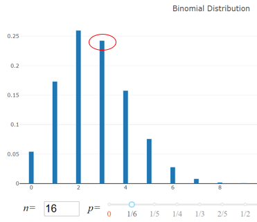

# Binominalverteilung

[bspInteraktives Widget](https://matheguru.com/stochastik/binomialverteilung.html)

"Binominal" bedeutet, dass es zwei diskrete, sich gegenseitig ausschließende Ergebnisse eines Zufallsexperiments gibt.
* Kopf oder Zahl
* an oder aus
* krank oder gesund
* Erfolg (success) oder Misserfolg (failure)

## Bernoulli-Experiment
Ein Bernoulli-Experiment ist ein Zufallsexperiment mit genau zwei möglichen Versuchsausgängen: Erfolg oder Misserfolg
Eine Reihe von Versuchen n wird so lange einer binären Verteilung folgen wie
	a) Die Erfolgswahrscheinlichkeit p konstant ist 
	b) Die Versuche unabhängig voneinander sind 

## Wahrscheinlichkeitsfunktion einer binominalen Zufallsvariablen

* Gibt die Wahrscheinlichkeit an, x Erfolge in n Versuchen zu beobachten
* Die Erfolgswahrscheinlichkeit für einen einzigen Versuch ist mit p bezeichnet
* Die Wahrscheinlichkeit eines Erfolgs p verändert sich nicht von Versuch zu Versuch

Formel:
$$P(x: n, p)=\left(\begin{array}{l}n \\ x\end{array}\right)(p)^{x}(1-p)^{(n-x)}$$

## Binominalverteilung am Bsp Münzwurg => P = 0.5

interpreation 1
Die P dass bei n = 50 Würfen ereignis 19 Kopf (oder 19Zahl) kommt ist ca 0.02 (übrigens gleich hoch wie dass 31 kopf oder Zahl kommt)
interpreation 2
die Wahrscheinglichekit für 29 / 21 die gleihe Ausprägung ist ebenfalls gleich
Interpreation3 
Die größte Wahrscheinlichkeit ist dass 25 Kopf und 25 Zahl kommen ist am höchsten. 

## Übung
Wenn du einen Würfel 16 Mal würfelst, wie groß ist dann die Wahrscheinlichkeit, dass eine Fünf 3 Mal auftaucht?

Basierend auf dem Diagramm, sollte diese bei knapp 0,25 liegen
𝑥 = 3, 𝑛 = 16, 𝑝 = 1/6

$P(x: n, p)=\left(\begin{array}{l}n \\ x\end{array}\right)(p)^{x}(1-p)^{(n-x)}$ => $=\left(\frac{n !}{x !(n-x) !}\right)(p)^{x}(1-p)^{(n-x)}$ => $=\left(\frac{16 !}{3 !(13) !}\right)(1 / 6)^{3}(5 / 6)^{(13)}$ => $=\left(\frac{16 \cdot 15 \cdot 14}{3 \cdot 2}\right)\left(\frac{1^{3}}{6^{3}}\right)\left(\frac{5^{13}}{6^{13}}\right)=0.242$

