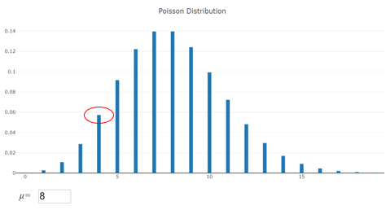

# Poisson-Verteilung

[PythonImplementierung](https://github.com/JHC90/Basic-DataScience-Skills/blob/master/Statistic-Basics/6_Poisson.ipynb) der Aufgaben die hier behandelt werden. 

## Quick & Dirty
Eine Binomialverteilung berücksichtigt die Anzahl der Erfolge aus n Versuchen.
Eine Poisson-Verteilung berücksichtigt die Anzahl der Erfolge pro Intervall(bspw Zeiteinheit/Entfernung) im Verlauf mehrerer Ereignisse.

## Herleitung
Die Berechnung der Poisson-Wahrscheinlichkeitsfunktion beginnt mit einem Erwartungswert, welchem anschliesend der Lambda zugewiesen wird:

$E(X)=\mu$ = $\frac{\# \text { occurrences }}{\text { interval }} = \lambda$

Die Gleichung der Poisson-Verteilung lautet:

$P(x)=\frac{\lambda^{x} e^{-\lambda}}{x !}$

## Übung 1 // Poisson simple

Ein Lager erhält normalerweise am Freitag zwischen 16 Uhr und 17 Uhr 8 Lieferungen.
Wie hoch ist die Wahrscheinlichkeit, dass an diesem Freitag nur 4 Lieferungen zwischen 16 und 17 Uhr ankommen?

Graphisch:

Rechnung: 
x <mark>=</mark> 4
$\lambda$ = 8
e = eulersche Zahl = 

$P(x)=\frac{\lambda^{x} e^{-\lambda}}{x !}=\frac{8^{4} \cdot 2.71828^{-8}}{4 !}$ $=\frac{4096 \cdot\left(\frac{1}{2980.96}\right)}{24}=0.0572$

##  Erweiterung: kumulative Verteilungsfunktion

Die kumulative Verteilungsfunktion ist einfach die Summe aller diskreten Wahrscheinlichkeiten  
BSP
Die Wahrscheinlichkeit, weniger als 4 Ereignisse in einer Poisson-Verteilung zu sehen, ist:

$P(X: x<4)=\sum_{i=0}^{3} \frac{\lambda^{i} e^{-\lambda}}{i !}$ $=\frac{\lambda^{0} e^{-\lambda}}{0 !}+\frac{\lambda^{1} e^{-\lambda}}{1 !}+\frac{\lambda^{2} e^{-\lambda}}{2 !}+\frac{\lambda^{3} e^{-\lambda}}{3 !}$

Denke daran, dass die Summe aller Möglichkeiten gleich 1 ist

Die Wahrscheinlichkeit, mindestens 1 Ereignis zu erhalten, ist 1 minus die Wahrscheinlichkeit, keine zu erhalten:

$P(X: x \geq 1)=1-P(X: x=0)$ $=1-\frac{\lambda^{0} e^{-\lambda}}{0 !}=1-e^{-\lambda}$

## Übung 2 Poisson Kummuliert

Ein Lager erhält normalerweise am Freitag zwischen 16 und 17 Uhr 8 Lieferungen.
Wie groß ist die Wahrscheinlichkeit, dass weniger als 3 an diesem Freitag zwischen 16 und 17 Uhr ankommen?

$P(X: x<3)=\sum_{i=0}^{2} \frac{\lambda^{i} e^{-\lambda}}{i !}=\frac{\lambda^{0} e^{-\lambda}}{0 !}+\frac{\lambda^{1} e^{-\lambda}}{1 !}+\frac{\lambda^{2} e^{-\lambda}}{2 !}$ 
$=\frac{8^{0} \cdot 2.71828^{-8}}{0 !}+\frac{8^{1} \cdot 2.71828^{-8}}{1 !}+\frac{8^{2} \cdot 2.71828^{-8}}{2 !}$ 
$=\frac{1 \cdot\left(\frac{1}{2980.96}\right)}{1}+\frac{8 \cdot\left(\frac{1}{2980.96}\right)}{1}+\frac{64 \cdot\left(\frac{1}{2980.96}\right)}{2}$ 
=0.0137

## Erweiterung: Poisson Teil-Intervalle

Die Poisson-Verteilung geht davon aus, dass die Erfolgswahrscheinlichkeit während eines kleinen Zeitintervalls proportional zur gesamten Länge des Intervalls ist.
Wenn du denn Erwartungswert λ über eine Stunde kennst, ist der Erwartungswert für eine Minute dieser Stunde:

$\lambda_{\text {minute}}=\frac{\lambda_{\text {hour}}}{60}$

## Übung 3 Poisson Teil-Intervall
Ein Lager erhält normalerweise am Freitag zwischen 16 und 17 Uhr 8 Lieferungen.
Wie hoch ist die Wahrscheinlichkeit, dass an diesem Freitag zwischen 16:00 und 16:05 keine Lieferungen ankommen?

$\lambda_{5 \text { minutes }}=\frac{\lambda_{1 \text { hour }}}{60 / 5}=\frac{8}{12}=0.6667$ 
$P(x)=\frac{\lambda^{x} e^{-\lambda}}{x !}=\frac{0.67^{0} \cdot 2.71828^{-0.6667}}{0 !}$ = 0.5134 

