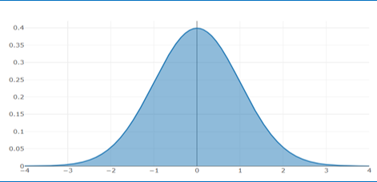
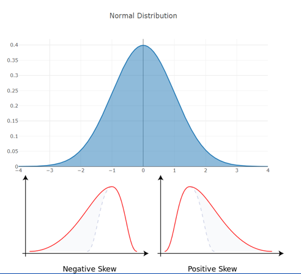
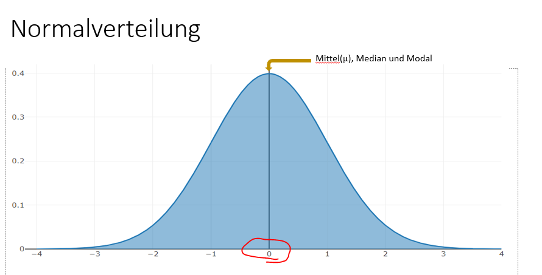
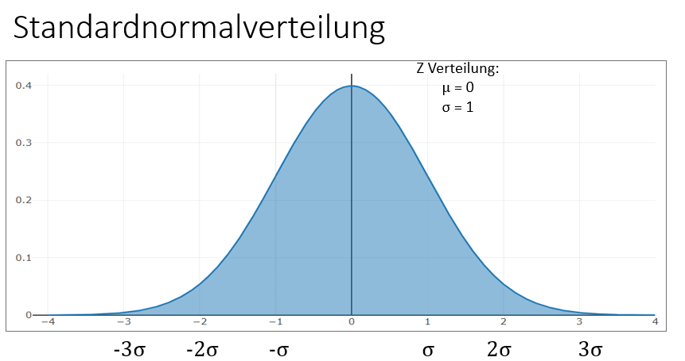
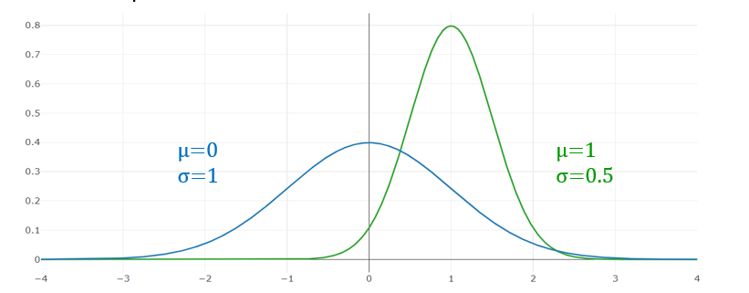
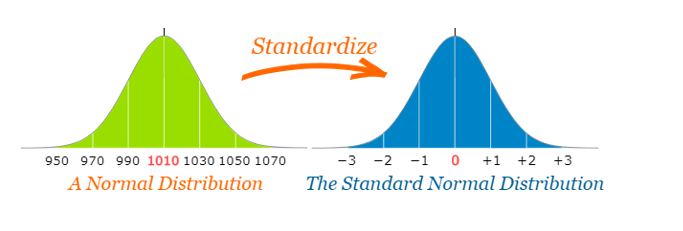
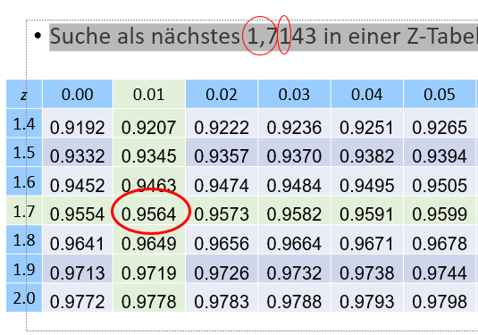

# Normalverteilung

## Erklärung
Viele reale Datenpunkte folgen einer normalen Verteilung:

* Größe und Gewicht von Menschen
* Blutdruck der Bevölkerung
* Prüfungsergebnisse
* Messfehler

Diese Datenquellen bewegen sich in der Regel in der Nähe eines zentralen Werts ohne Schiefe nach links oder rechts und nähern sich einer "Normalverteilung" an:

Wir verwenden eine stetige Verteilung, um das Verhalten dieser Datenquellen zu modellieren.
Beachten Sie die durchgehende Linie und den Bereich in dieser WDF = WahrscheinlichkeitsDichteFunktion.

Im Gegensatz zu diskreten Verteilungen, bei denen die Summe aller Striche gleich eins ist, ist bei einer Normalverteilung die Fläche unter der Kurve gleich eins:

Normalverteilung wird auch als Glockenkurve oder Gaußsche Normalverteilung bezeichnet und ist 
immer symmetrisch => asymetrisch ist nicht normalverteilt => [NeigungVonKurven](./EDA_0_Lagemaße_9_NeigungVonKurven.md)

die Punktwahrscheinlichkeit ist null
Wir können Wahrscheinlichkeiten nur über einen Wertintervall oder eine Reihe von Ergebnissen finden

## Standardardnomralveteilung
Standardnormalverteilung ist eine Normalverteilung wenn folgende werte zutreffen (jede Standardnormalverteilung == Normalverteilt // nicht jede normlaverteilte == standardnormalverteilt)
z-Verteilung
$\mu$ = Mean = 0
$\sigma$ = std = 1

## Normalverteilung vs Standardnormalverteilt
Alle normalverteilten Kurven weisen das gleiche Verhalten auf:
* Symmetrisch zum Mittelwert (Erwartungswert)
* 99,73% der Werte liegen innerhalb von drei Standardabweichungen 

Der Mittelwert muss jedoch nicht null sein, und σ muss nicht eins sein.

Wenn wir feststellen, dass sich eine Population einer Normalverteilung annähert,
dann können wir einige wichtige Schlüsse darüber ziehen, wenn wir wissen, dass es sich um den Mittelwert (Erwartungswert) und eine Standardabweichung handelt

## Formeln der Normalverteilung

in der [Statistik](./Statistics_Basics_000_WahrscheinlichkeitUndStatistik.md) werden Stichproben-, Standardfehler- und [Hypothesentests ](./Statistics_Basics_020Hypothesentests.md)zur Auswertung von Experimente verwendet. Ein großer Teil dieser Prozedur besteht darin, zu verstehen, wie man eine Normalverteilung "standardisiert".

Wir können jede Normalverteilung nehmen und sie auf eine normale Standardnormalverteilung standardisieren.
Wir werden in der Lage sein, jeden Wert aus einer Normalverteilung zu nehmen und ihn durch einen Z-Wert zu standardisieren. Mit diesem Z-Wert können wir dann das [Perzentil](./EDA_0_Lagemaße_10_Quantil.md) eines bestimmten x-Wertes berechnen.

(wenn ein Schüler die Note 1,5 erhält und diese Note im [Perzentil](./EDA_0_Lagemaße_10_Quantil.md)  	90 liegt, dann wissen wir, dass 90% aller anderen Schüler 	schlechter als eine 1,5 erreicht haben)

Wenn wir unsere Daten als Normalverteilung modellieren können, können wir die Werte in der Normalverteilung in eine Standardnormalverteilung konvertieren, um ein [Perzentil](./EDA_0_Lagemaße_10_Quantil.md)  zu berechnen.

Zum Beispiel können wir eine Normalverteilung von Testwerten mit einer Mittelwert- und Standardabweichung haben.
Wir können dann einen Z-Wert verwenden, um das [Perzentil](./EDA_0_Lagemaße_10_Quantil.md)  eines bestimmten Testergebnisses herauszufinden.

## Normalverteilungsformel
mit dieser Formel können normalverteilte Kurven in die Standardnormalform übergeführt werden. Das macht man , dass Ergebnisse vergleichbar werden. Check die Übug unten für das Verständnis
$$f(x)=\frac{1}{\sqrt{2 \pi \sigma^{2}}} e^{\frac{-(x-\mu)^{2}}{2 \sigma^{2}}}$$

μ = Erwartungswert		
e = 2.71828
σ = Standardabweichung		
π = 3.14159

Dadurch entsteht ein Erwartungswert von 0 und einer Standardabweichung von 1

## Z-Wert und Z-Tabelle

Um einen Einblick in einen bestimmten Wert 𝑥 (nicht einer ganzen Datenserie, die eine Kurve beschreieben würde, sondern eben nur einem einzelnen Wert) in einer normalverteilten Populationen zu erhalten, standardisieren wir 𝑥 indem wir einen Z-Wert berechnen:

$z=\frac{x-\mu}{\sigma}$

Wir können dann das [Perzentil](./EDA_0_Lagemaße_10_Quantil.md)  von 𝑥 bestimmen, indem wir auf eine Z-Tabelle (Standardnormalverteilungstabelle) zurückgreifen

Eine [Z-Tabelle](./Table-z-distribution.pdf) von einer standardnormalverteilten Wahrscheinlichkeit bildet einen bestimmten Z-Wert im Bereich links vom Wert unter einer Normalverteilungskurve ab.
Da die Gesamtfläche unter der Kurve 1 ist, sind die Wahrscheinlichkeiten durch 0 und 1 begrenzt

## BSP-Verwendung Z-Werte
Ein Unternehmen sucht einen neuen Datenbankadministrator.
Du gibst den Bewerbern einen standardisierten Test, um ihr technisches Wissen zu testen.
Deine erste Bewerberin, Maria, bekommt 87 Punkte
Ist Maria aufgrund ihrer Punktzahl außergewöhnlich qualifiziert?

<b>Lösung</b>
Um zu entscheiden, wie gut ein Bewerber abgeschnitten hat, müssen wir alle Bewerber betrachten.
Basierend auf Tausenden von früheren Tests, wissen wir, dass der Mittelwert 75 von 100 ist, mit einer Standardabweichung von 7 Punkten.

Konvertiere zuerst Maria‘s Wert in einen standardisierten Z-Wert mithilfe der Formel:
$z=\frac{x-\mu}{\sigma}$  $=\frac{87-75}{7}=1.7143$

Suche als nächstes 1,7143 in einer Z-Tabelle:

0.9564 stellt den Bereich links von Marias Testergebnis dar
Das bedeutet, dass Maria 95,64% der anderen, die den gleichen Test gemacht haben, übertroffen hat.

