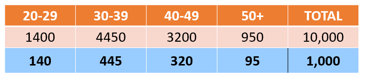

# Zentraler Grenzwertsatz

## Begriffe
* Die Population ist jedes Mitglied einer Gruppe, die wir  untersuchen wollen

* Die Stichprobe ist eine kleine Gruppe von (hoffentlich) zufälligen Mitgliedern dieser Gruppe

* Ein Parameter ist ein (echtes) Merkmal einer Population. Oft wollen wir Parameter verstehen.

* Ein statistischer Wert ist die Eigenschaft einer Stichprobe. Häufig wenden wir statistische Rückschlüsse aus Stichprobe an, mit dem Ziel, die Gesamtpopulation zu beschreiben.

* Eine Variable(~Feature) ist ein Merkmal, das ein Mitglied der Stichprobe beschreibt. Variablen können diskret oder stetig sein

## Stichproben
Einer der großen Vorteile statistischer Modelle besteht darin, dass eine Stichprobe mit einer hinreichenden Größe willkürlich ausgewählter Elemente (>30) fast immer die Population widerspiegelt.Die Herausforderung wird sein: wie wählen wir die Elemente zufällig aus, um Verzerrungen (en:. bias) zu vermeiden ?

## Bias / Verzerrung
Es gibt verschiedene Formen der Verzerrungen: 
* Auswahlverzerrung (selection bias)
Die vielleicht häufigste Art, bei dieser Verzerrung werden Mitglieder einer Population begünstigt, die eher bereit und in der Lage sind Umfragen zu Beantworten. 

  * Verzerrung durch Unterdeckung (Undercoverage Bias):
zu wenige Beobachtungen machen oder ganze Segmente einer Population auslassen. (Eine Mitarbeiterbefragung in einem Krankenhaus, die tagsüber durchgeführt wurde vernachlässigt die Befragung der Teilnehmer, die in der Nachtschicht arbeiten)

  * Verzerrung durch Selbstselektion (Self-selection Bias):
Personen, die sich beispielsweise freiwillig bereit erklären, können sich erheblich von denen in der Bevölkerung unterscheiden, die dies nicht tun(Eine Online-Umfrage über eine Sportmannschaft Werden nur Leute beantworten, die sich für dieses Team stärker interessieren)

  * Verzerrung durch Gesundheitszustände (Healthy-user Bias):
Die Stichprobe kann aus einem gesünderen Segment der Gesamtbevölkerung stammen - Menschen, die laufen / joggen, draußen arbeiten, sich gesünderer verhalten usw.(Eine Umfrage bei Kunden an einem Obststand durchzuführen, um eine Verbindung zwischen Ernährung und Gesundheit zu untersuchen wird vermutlich Menschen erreichen, die auch andere Dinge tun, die einen noch größeren Einfluss auf ihre Gesundheit haben.)

* Überlebensirrtum (survivorship bias):
   Wenn sich eine Bevölkerung im Laufe der Zeit weiterentwickelt, kann es daran liegen, dass weniger Mitglieder die Bevölkerung aufgrund von Tod, Vertreibung, Umsiedlung usw. verlassen. BSP (WWII / Stahlhelme => Verletzung & Tod || Rüstungflugzeugte an stellen die nicht getroffen wurden)

## Stichprobenarten

* Einfache Zufallsstichprobe (Random)
  Wie der Name schon sagt, bedeutet Zufallsstichprobe, dass jedes Mitglied einer Population die gleiche Chance hat, ausgewählt zu werden. Da die Stichproben in der Regel jedoch viel kleiner sind als die Population, besteht die Gefahr, dass damit nicht die gesamte Demografie abgedeckt wird.

* Geschichtete Zufallsstichprobe (Stratified Random)
  Die geschichtete Zufallsstichprobe (en.: stratisfied random sampling) gewährleistet, dass verschiedene Gruppen innerhalb einer Population angemessen vertreten sind. Dazu wird die Population zunächst  anhand von Merkmalen in Segmente ein. Mitglieder können nicht zwei Gruppen gleichzeitig angehören. Als nächstes nehmen wir Stichproben aus jeder Gruppe. Die Größe jeder Stichprobe(aus den subgruppen) basiert auf der Größe der Gruppe im Verhältnis zur Population.

  Bsp geschichtete Stichproben(blaue Zeile) in höhe von 10% von der Poulation()
  blaue Zeile = höhe Stichrpobe
  blass orange Zeile = Population
  orange Zeile = Gruppen (Alter der Kunden)

  

* Klumpenstichprobe (Cluster)
  Eine dritte - und oft weniger präzise - Methode der Stichprobenerhebung ist das Clustering. Die Idee besteht darin, die Population in Gruppen aufzuteilen und eine zufällige Auswahl von Gruppen oder Clustern zu testen. Normalerweise wird dies getan, um Kosten zu reduzieren. (Eine Marketingfirma schickt Meinungsforscher zu einer Handvoll Nachbarschaften (anstatt eine ganze Stadt zu abzuklappern) // Ein Forscher untersucht Fischerboote, die sich an einem bestimmten Tag im Hafen befinden (Convenience Sampling).)
