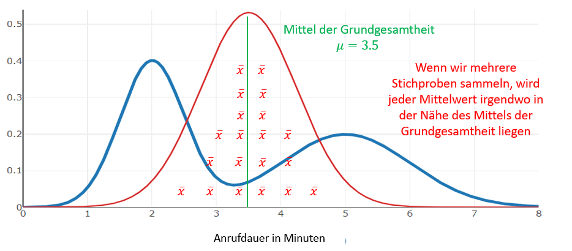

# Zentraler Grenzwertsatz

## Erklärung
Was die Stichprobenerhebung zu einem so guten statistischen Werkzeug macht, ist der zentrale Grenzwertsatz. Erinnern wir uns daran, dass ein Stichprobenmittel oft vom Bevölkerungsdurchschnitt abweicht. Der zentrale Grenzwertsatz berücksichtigt eine große Anzahl von Stichproben.

Der zentrale Grenzwertsatz besagt, dass sich die Verteilung der Stichprobenmittelwerte mehrerer Stichproben mit wachsendem Stichprobenumfang einer [Normalverteilung](./Statistics_Basics_015_Normalverteilung.md) annähert, auch wenn die Grundgesamtheit selbst nicht normal verteilt ist. Das heißt, 95% aller Stichprobenmittel sollten innerhalb von 2σ des Populationsmittels liegen

BSP: Anrufdauer im Kundencenter:

