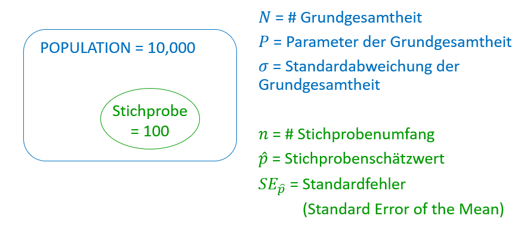

# Standardfehler

## Begriffe & Abkürzungen
Standardfehler = StandardError = SE

## Formel Standardfehler
$S E_{\bar{x}}=\frac{\sigma}{\sqrt{n}}$

$\sigma$ = Die standardabweichung der Population

## Erklärung am BSP:

Annahme:
Population Austrailien = 10000

Wenn die Bevölkerung Australiens(= Population) durchschnittlich 1,75m groß ist und für unsere 100-Personen-Stichprobe ist die durchschnittliche Größe 1,76m beträgt

𝑃=1,75m 
𝑝 ̂=1,76𝑚

Selbst organisieren:
[Standardabweichung](./EDA_2_Streuungsmaße_2_Std.md) => kann ich hier nicht berechnen, da ich die einzelnen Paare nicht hab, & die Standardabweichung selbst nicht angegeben wird

## BSP-Implementierung Standardfehler
Ein IQ-Test hat eine durchschnittliche Punktzahl von 100 mit einer Standardabweichung von 15 Punkten. Wenn eine Stichprobe von 10 Tests einen Mittelwert von 104 hat, können wir annehmen, dass sie die allgemeinen Bevölkerung repräsentieren?

$\bar{x}$ = 100
$\sigma$ = 15
n = 10

$S E_{\bar{x}}=\frac{\sigma}{\sqrt{n}}$ = $\frac{15}{\sqrt{10}}$ = 4.743

Das heißt dass innerhalb der ersten Standardabweichung(68%) einen Punktestand von 100 ± SE = 95,257 || 104,743 => hierzu brauch ich die Konfidenzintervalle. das hier ist das Konfidenzintervall 1