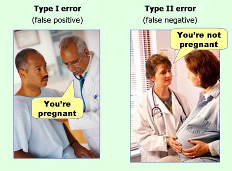

# Fehler erster (Typ I) und zweiter Art (Typ II)

# Erklärung
Oft werden in medizinischen Bereichen (und anderen wissenschaftlichen Gebieten) Hypothesentests verwendet, um gegen Ergebnisse zu testen, bei denen die "Wahrheit" bereits bekannt ist.
Zum Beispiel, wird ein neuer diagnostischer Test für Krebspatienten getestet, deren Diagnose bereits mit anderen Mitteln festgestellt wurde.
In dieser Situation wissen wir ja bereits, ob die Nullhypothese wahr oder falsch ist.
In diesen Situationen, in denen die "Wahrheit" bereits bekannt ist, wissen wir, dass es möglich ist, mit unseren Ergebnissen Fehler zu erzeugen.

Diese Art der Analyse tritt so häufig auf, dass diese Fehler bereits spezifische Namen haben:
Fehler erster Art (Typ I Error)
Fehlertyp zweiter Art (Typ II Error)

## Fehler erster Art(Typ I) 
Wenn wir eine Nullhypothese ablehnen, die jedoch richtig ist und unterstützt werden sollte, haben wir einen Fehler erster Art begangen

𝑯_𝟎:𝑒𝑠 𝑏𝑟𝑒𝑛𝑛𝑡 𝑛𝑖𝑐ℎ𝑡
Ich betätige den Feueralarm, um zu prüfen, dass es wirklich kein Feuer gab.

## Fehler zweiter Art (Typ II) 

Wenn wir eine Nullhypothese nicht ablehnen, die jedoch falsch ist und abgelehnt werden sollte, haben wir einen Fehler zweiter Art begangen

𝑯_𝟎:𝑒𝑠 𝑏𝑟𝑒𝑛𝑛𝑡 𝑛𝑖𝑐ℎ𝑡
Ich betätige den Feueralarm nicht, nur um festzustellen, dass es brennt.

𝑯_𝟎:𝑛𝑖𝑐ℎ𝑡 𝑠𝑐ℎ𝑤𝑎𝑛𝑔𝑒𝑟
𝑯_𝟏:𝑠𝑐ℎ𝑤𝑎𝑛𝑔𝑒𝑟

