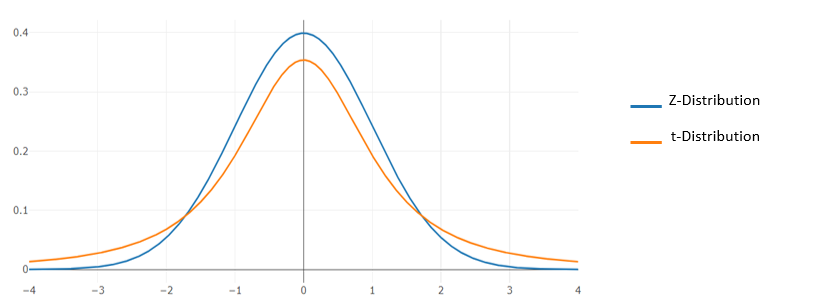

# Studentsche t-Verteilung
Erinnern wir uns: wenn wir Z-Werte mit einer Normalverteilung verwendeten, dann müssen wir die Standardabweichung (Sigma) der Population kennen, um Z zu berechnen.

Aber was ist, wenn wir in der realen Welt die Standardabweichung der Population nicht kennen?

Entwickelt von William Sealy Gossett während er in der Guinness Brauerei arbeitete
Veröffentlicht unter dem Pseudonym "Student" weil Guinness ihm verbot, seinen Namen zu verwenden.
Ziel war es, die beste Gerste aus kleinen Proben auszuwählen, obwohl die Standardabweichung der Population unbekannt war!

<b>Unter Verwendung der T-Tabelle bestimmt der Studentsche-T-Test, ob es einen signifikanten Unterschied zwischen zwei Datensätzen gibt</b>

Aufgrund von Varianz und Ausreißern reicht es nicht aus, nur die Mittelwerte zu vergleichen
Ein t-Test berücksichtigt auch die Stichprobenvarianz

# Typen vom t-Test
* Einstichproben t-Test (one-sample t-test)
Testet die Nullhypothese, dass der Mittelwert der Population gleich einem spezifischen Wert μ ist, basierend auf dem Stichprobenmittelwert.

Wir möchten prüfen, ob eine Stichprobe von Schülern die gleichen durchschnittlichen Testergebnisse wie die Gesamtschülerzahl aufweist.

* Zweistichproben-t-Test (indipendent two-sample t-test)
Prüft die Nullhypothese, dass zwei Stichprobenwerte $\overline{\mathcal{X}}_{1}$ und $\overline{\mathcal{X}}_{2}$ gleich sind.

Wir möchten überprüfen, ob die durchschnittlichen Testergebnisse von zwei separaten Stichproben von Schülern einen statistisch signifikanten Unterschied aufweisen?

* Gepaarter/abhängiger t-Test (Dependent, paired-sample t-test)
Wird verwendet, wenn die Stichproben abhängig sind:
eine Probe wurde zweimal getestet (wiederholte Messungen)
zwei Proben wurden verglichen oder „gepaart“.

Wir möchten prüfen, ob die gleiche Gruppe von Schülern vor dem Vorbereitungskurs und nach dem Vorbereitungskurs ihre Testergebnisse verbessern konnte?
Wir müssen beachten, dass wir dieselbe Stichprobe von Schülern verwenden (diese also abhängig ist)

## Vorgehen t-Statistik
### Einstichproben-t-Test
1. Kalkuliere die T-Statistik:
 $t=\frac{\bar{x}-\mu}{s / \sqrt{n}}$
 mit:
\bar{x}= Stichprobenmittel
𝜇 = Mittelwert Population
𝑠 = Standardfehler der population (!!!!<= eben diesen Wert kennen wir nicht>)
𝑛 = Stichprobengröße

2. Wie bei den Z-Werten vergleichen wir die t-Werte nun mit einer t-Wert-Tabelle.
Diese Werte hängen ab von:
   * Den Freiheitsgrade (basierend auf der Stichprobengröße n)
   * Dem gewählten Signifikanzniveau (Standard 0,05)

    Formel:
    $t ≶ t_{n-1, \alpha}$

    mit
    𝑡 	= t-Wert
    𝑡_(𝑛−1,𝛼)	= kritischer t-Wert
    𝑛−1	= Freiheitsgrad
    𝛼	= Signifikanzniveau

### Zweistichproben-t-Test
Die Berechnung der t-Werte unterscheidet sich für die folgenden Szenarien geringfügig:
* gleiche Stichprobengröße, gleiche Varianz
* ungleiche Stichprobengrößen, gleiche Varianz
* gleiche oder ungleiche Stichprobengrößen, ungleiche Varianz

Wenn man mit zwei Stichproben arbeitet und versucht, sie mit einem t-Test zu vergleichen, ist es oft nützlich, sich den t-Test als Verhältnis von Signal (Stichprobenmittel) zu Rauschen (Stichprobenvariabilität) vorzustellen (Signal-Rausch-Verhältnis oder Störabstand).

1. Kalkuliere die T-Statistik:
Formel:
$t=\frac{\text {Signal}}{\text {Rauschen}}=\frac{\text {Stichprobenmitteldifferenz}}{\text {Stichprobenvariabilität}}=\frac{\overline{x_{1}}-\overline{x_{2}}}{\sqrt{\frac{s_{1}^{2}}{n_{1}}+\frac{s_{2}^{2}}{n_{2}}}}$

2. Vergleich mit einem t-Wert
Formel:
    $t ≶ t_{df, \alpha}$
    mit 
    𝑡	= t-Wert
	𝑡_(𝑑𝑓,𝛼)	= kritischer t-Wert
	𝑑𝑓	= Freiheitsgrade ( Welch-Satterthwaite Formel für 𝑑𝑓 (Freiheitsgrade))
	𝛼	= Signifikanzlevel

3. Berechne df
 $d f=\frac{\left(\frac{s_{1}^{2}}{n_{1}}+\frac{s_{2}^{2}}{n_{2}}\right)^{2}}{\frac{1}{n_{1}-1}\left(\frac{s_{1}^{2}}{n_{1}}\right)^{2}+\frac{1}{n_{2}-1}\left(\frac{s_{2}^{2}}{n_{2}}\right)^{2}}$ 

    Allgemeine Formel df= $n_{1} +n_{2}-2$

## Vergelich zur Z-Distribtuion 

## Beispielimplementierung
[Beispielimplementierung](https://github.com/JHC90/Basic-DataScience-Skills/blob/master/Statistic-Basics/9_t-Verteilung.ipynb)

