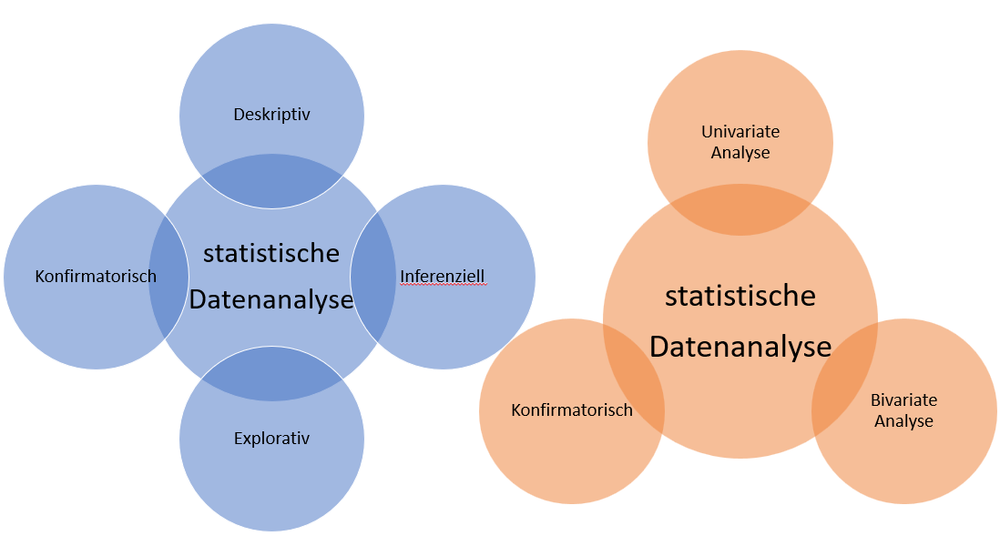

# Statistik-Bereich
Datenanalyse, 

## Allgemein
statistische Datenanalyse; statistische Methoden, mit welchen aus vorliegenden Einzeldaten zusammenfassende Informationen (Kenngrößen) gewonnen und tabellarisch oder grafisch dokumentiert werden.

**Art der Statistik|Datenanalyse**
1. Deskriptive Statistik
2. Inferenzielle Datenanalyse
3. explorative
4. konfirmatorischen 

**Art der Input-Daten**
1. [univerate Analysemethoden](https://wirtschaftslexikon.gabler.de/definition/univariate-analysemethoden-48645)
2. [bivariate Analysemethoden](https://wirtschaftslexikon.gabler.de/definition/bivariate-analysemethoden-29641)
3. [multivariate Analysemethoden](https://wirtschaftslexikon.gabler.de/definition/multivariate-analysemethoden-41825)

---
**Deskriptive Datenanalyse:** 
Liegt eine Totalerhebung oder generell ein Datensatz vor, so ist es die Aufgabe der Datenanalyse, die in den Einzeldaten enthaltene Information zu verdichten und diese so darzustellen, dass Wesentliches deutlich wird. Dazu werden Tabellen, graphische Darstellungen und charakteristische Maßzahlen verwendet.  Die Datenanalyse hat ausschließlich beschreibenden Charakter (deskriptive Statistik).

---
**Inferenzielle Datenanalyse:**
 Bei einer Stichprobenerhebung (Teilerhebung) liegt der Schwerpunkt der Datenanalyse auf der Übertragung der Stichprobenbefunde auf die Grundgesamtheit auf der Basis eines statistischen Modells. Wesentliche Verfahren der Inferenzstatistik sind Punktschätzung, Intervallschätzung und Hypothesenprüfung (statistische Testverfahren). Zur Datenanalyse gehört in diesem Fall z.B. die Angabe von Punktschätzwerten oder die Angabe von Konfidenzintervallen für Parameter der Grundgesamtheit.

---
**Explorative und Konfirmatorische Datenanalyse:**
Neben der deskriptiven und inferenziellen wird auch zwischen der explorativen und der konfirmatorischen Datenanalyse unterschieden. Bei der explorativen Datenanalyse wird die verfügbare Datenmenge verarbeitet mit der Absicht, Strukturen in den Daten oder einfache bzw. überschaubare Zusammenhänge hervortreten zu lassen oder auf diese Weise erst zu entdecken. Im Gegensatz dazu ist das Ziel der konfirmatorischen Datenanalyse die Überprüfung von Zusammenhängen (z.B. Regressionsanalyse oder der LISREL-Ansatz (LISREL) der Kausalanalyse).

## Links
Eigene Mind-Map:
https://www.goconqr.com/mexplorativenindmap/19391470/statistik-mindmap?locale=de